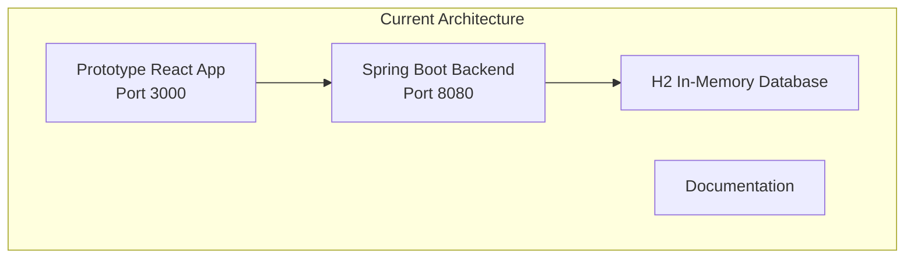
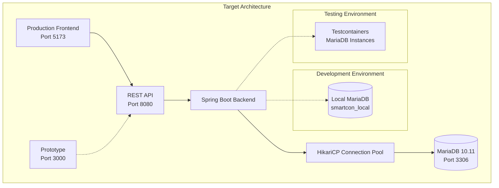
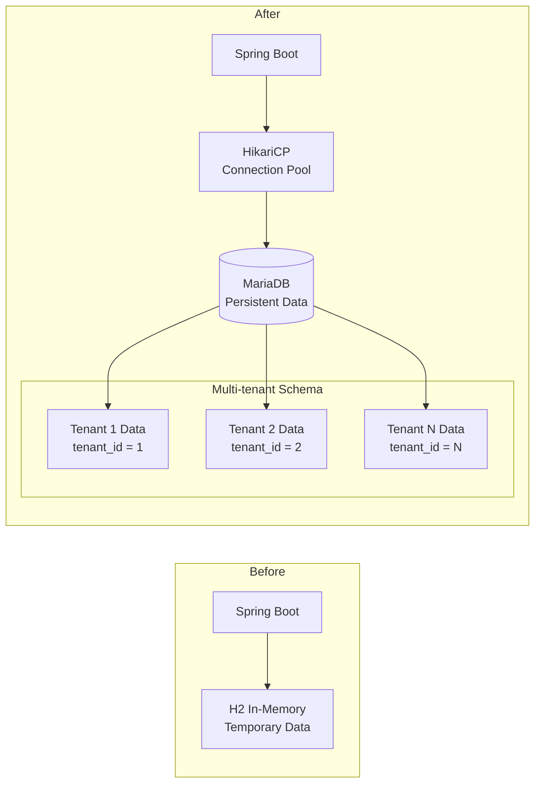

# Design Document

## Overview

이 설계는 SmartCON Lite 프로젝트에서 프로토타입과 별도의 프로덕션 프론트엔드를 분리하고, 백엔드의 H2 인메모리 데이터베이스를 MariaDB로 전환하는 작업을 다룹니다. 이를 통해 프로덕션 환경에서의 데이터 영속성, 성능, 확장성을 확보하고 프론트엔드와 백엔드의 독립적인 개발 및 배포를 가능하게 합니다.

## Architecture

## Architecture

### 현재 아키텍처


### 목표 아키텍처


### 데이터베이스 아키텍처 변경


## Components and Interfaces

### 1. 프론트엔드 컴포넌트

#### 1.1 새로운 Frontend 디렉토리 구조
```
frontend/
├── public/
│   ├── manifest.json
│   └── icons/
├── src/
│   ├── components/
│   │   ├── ui/              # Shadcn/UI 컴포넌트
│   │   ├── layout/          # 레이아웃 컴포넌트
│   │   ├── forms/           # 폼 컴포넌트
│   │   └── common/          # 공통 컴포넌트
│   ├── pages/               # 역할별 페이지
│   │   ├── auth/
│   │   ├── super/
│   │   ├── hq/
│   │   ├── site/
│   │   ├── team/
│   │   └── worker/
│   ├── hooks/               # 커스텀 훅
│   ├── stores/              # Zustand 스토어
│   ├── services/            # API 서비스
│   ├── types/               # TypeScript 타입
│   ├── utils/               # 유틸리티
│   ├── styles/              # 스타일
│   └── assets/              # 정적 자산
├── package.json
├── vite.config.ts
├── tailwind.config.js
├── tsconfig.json
└── .env.example
```

#### 1.2 환경별 설정 및 보안
```typescript
// frontend/src/config/environment.ts
interface Environment {
  API_BASE_URL: string;
  NODE_ENV: 'development' | 'staging' | 'production';
  ENABLE_DEVTOOLS: boolean;
  API_TIMEOUT: number;
  RETRY_ATTEMPTS: number;
}

const environments: Record<string, Environment> = {
  development: {
    API_BASE_URL: 'http://localhost:8080/api/v1',
    NODE_ENV: 'development',
    ENABLE_DEVTOOLS: true,
    API_TIMEOUT: 10000,
    RETRY_ATTEMPTS: 3,
  },
  staging: {
    API_BASE_URL: 'https://api-staging.smartcon.kr/api/v1',
    NODE_ENV: 'staging',
    ENABLE_DEVTOOLS: false,
    API_TIMEOUT: 15000,
    RETRY_ATTEMPTS: 2,
  },
  production: {
    API_BASE_URL: 'https://api.smartcon.kr/api/v1',
    NODE_ENV: 'production',
    ENABLE_DEVTOOLS: false,
    API_TIMEOUT: 20000,
    RETRY_ATTEMPTS: 1,
  },
};

export const getEnvironment = (): Environment => {
  const env = import.meta.env.MODE || 'development';
  return environments[env] || environments.development;
};
```

#### 1.3 API 클라이언트 아키텍처
```typescript
// frontend/src/services/api/client.ts
class ApiClient {
  private axiosInstance: AxiosInstance;
  private tokenManager: TokenManager;
  
  constructor() {
    const config = getEnvironment();
    this.axiosInstance = axios.create({
      baseURL: config.API_BASE_URL,
      timeout: config.API_TIMEOUT,
      headers: {
        'Content-Type': 'application/json',
        'Accept': 'application/json',
      },
    });
    
    this.setupInterceptors();
  }
  
  private setupInterceptors() {
    // Request interceptor for auth token
    this.axiosInstance.interceptors.request.use(
      (config) => {
        const token = this.tokenManager.getAccessToken();
        if (token) {
          config.headers.Authorization = `Bearer ${token}`;
        }
        return config;
      },
      (error) => Promise.reject(error)
    );
    
    // Response interceptor for token refresh
    this.axiosInstance.interceptors.response.use(
      (response) => response,
      async (error) => {
        if (error.response?.status === 401) {
          await this.tokenManager.refreshToken();
          return this.axiosInstance.request(error.config);
        }
        return Promise.reject(error);
      }
    );
  }
}
```

### 2. 백엔드 컴포넌트

#### 2.1 MariaDB 설정 구조
```yaml
# backend/src/main/resources/application.yml
spring:
  profiles:
    active: local
  
  jpa:
    hibernate:
      ddl-auto: validate
    show-sql: false
    properties:
      hibernate:
        dialect: org.hibernate.dialect.MariaDBDialect
        format_sql: true
  
  flyway:
    enabled: true
    locations: classpath:db/migration
    baseline-on-migrate: true
```

#### 2.2 환경별 데이터베이스 설정 및 보안
```yaml
# application-local.yml
spring:
  datasource:
    url: jdbc:mariadb://localhost:3306/smartcon_local?useUnicode=true&characterEncoding=utf8mb4&useSSL=false&allowPublicKeyRetrieval=true
    username: smartcon_user
    password: smartcon_pass
    driver-class-name: org.mariadb.jdbc.Driver
    hikari:
      maximum-pool-size: 10
      minimum-idle: 2
      connection-timeout: 20000
      idle-timeout: 300000
      max-lifetime: 1200000
      leak-detection-threshold: 60000

# application-dev.yml
spring:
  datasource:
    url: jdbc:mariadb://${DB_HOST:mariadb-dev}:${DB_PORT:3306}/${DB_NAME:smartcon_dev}?useUnicode=true&characterEncoding=utf8mb4&useSSL=true&serverSslCert=/etc/ssl/certs/server-cert.pem
    username: ${DB_USERNAME}
    password: ${DB_PASSWORD}
    hikari:
      maximum-pool-size: 20
      minimum-idle: 5
      connection-timeout: 30000
      idle-timeout: 600000
      max-lifetime: 1800000

# application-prod.yml
spring:
  datasource:
    url: jdbc:mariadb://${DB_HOST}:${DB_PORT:3306}/${DB_NAME}?useUnicode=true&characterEncoding=utf8mb4&useSSL=true&requireSSL=true&verifyServerCertificate=true
    username: ${DB_USERNAME}
    password: ${DB_PASSWORD}
    hikari:
      maximum-pool-size: 50
      minimum-idle: 10
      connection-timeout: 30000
      idle-timeout: 600000
      max-lifetime: 1800000
      leak-detection-threshold: 60000
  
  # Production-specific JPA settings
  jpa:
    hibernate:
      ddl-auto: validate
    show-sql: false
    properties:
      hibernate:
        dialect: org.hibernate.dialect.MariaDB106Dialect
        format_sql: false
        use_sql_comments: false
        jdbc:
          batch_size: 20
        order_inserts: true
        order_updates: true
```

#### 2.3 연결 풀 모니터링 및 헬스 체크
```java
@Component
@Slf4j
public class DatabaseConnectionMonitor {
    
    @Autowired
    private HikariDataSource dataSource;
    
    @Scheduled(fixedRate = 30000) // 30초마다 체크
    public void monitorConnectionPool() {
        HikariPoolMXBean poolBean = dataSource.getHikariPoolMXBean();
        
        log.info("Connection Pool Status - Active: {}, Idle: {}, Total: {}, Waiting: {}", 
            poolBean.getActiveConnections(),
            poolBean.getIdleConnections(),
            poolBean.getTotalConnections(),
            poolBean.getThreadsAwaitingConnection());
            
        if (poolBean.getActiveConnections() > poolBean.getMaximumPoolSize() * 0.8) {
            log.warn("Connection pool usage is high: {}%", 
                (poolBean.getActiveConnections() * 100.0) / poolBean.getMaximumPoolSize());
        }
    }
}
```

### 3. Docker 컴포넌트

#### 3.1 로컬 개발용 Docker Compose
```yaml
# docker/docker-compose.yml
version: '3.8'
services:
  mariadb:
    image: mariadb:10.11
    container_name: smartcon-mariadb
    environment:
      MYSQL_ROOT_PASSWORD: smartcon_root
      MYSQL_DATABASE: smartcon_local
      MYSQL_USER: smartcon_user
      MYSQL_PASSWORD: smartcon_pass
    ports:
      - "3306:3306"
    volumes:
      - mariadb_data:/var/lib/mysql
      - ./mariadb/init:/docker-entrypoint-initdb.d
    command: --character-set-server=utf8mb4 --collation-server=utf8mb4_unicode_ci

  redis:
    image: redis:7-alpine
    container_name: smartcon-redis
    ports:
      - "6379:6379"
    volumes:
      - redis_data:/data

volumes:
  mariadb_data:
  redis_data:
```

## Data Models

### 1. Flyway 마이그레이션 구조

#### 1.1 마이그레이션 파일 구조
```
backend/src/main/resources/db/migration/
├── V1__Create_initial_schema.sql
├── V2__Create_indexes.sql
├── V3__Insert_initial_data.sql
└── V4__Add_constraints.sql
```

#### 1.2 주요 테이블 스키마 (MariaDB 최적화)
```sql
-- V1__Create_initial_schema.sql
CREATE TABLE tenants (
    id BIGINT AUTO_INCREMENT PRIMARY KEY,
    business_number VARCHAR(12) NOT NULL UNIQUE,
    company_name VARCHAR(100) NOT NULL,
    status ENUM('TRIAL', 'ACTIVE', 'SUSPENDED', 'TERMINATED') NOT NULL DEFAULT 'TRIAL',
    created_at TIMESTAMP DEFAULT CURRENT_TIMESTAMP,
    updated_at TIMESTAMP DEFAULT CURRENT_TIMESTAMP ON UPDATE CURRENT_TIMESTAMP,
    INDEX idx_tenants_business_number (business_number),
    INDEX idx_tenants_status (status)
) ENGINE=InnoDB DEFAULT CHARSET=utf8mb4 COLLATE=utf8mb4_unicode_ci;

CREATE TABLE users (
    id BIGINT AUTO_INCREMENT PRIMARY KEY,
    tenant_id BIGINT NOT NULL,
    email VARCHAR(100) NOT NULL,
    name VARCHAR(50) NOT NULL,
    phone_number VARCHAR(20),
    provider ENUM('LOCAL', 'KAKAO', 'NAVER') NOT NULL DEFAULT 'LOCAL',
    provider_id VARCHAR(100),
    password_hash VARCHAR(255),
    is_active BOOLEAN DEFAULT TRUE,
    created_at TIMESTAMP DEFAULT CURRENT_TIMESTAMP,
    updated_at TIMESTAMP DEFAULT CURRENT_TIMESTAMP ON UPDATE CURRENT_TIMESTAMP,
    FOREIGN KEY (tenant_id) REFERENCES tenants(id) ON DELETE CASCADE,
    UNIQUE KEY unique_email_per_tenant (tenant_id, email),
    INDEX idx_users_tenant_id (tenant_id),
    INDEX idx_users_provider (provider, provider_id)
) ENGINE=InnoDB DEFAULT CHARSET=utf8mb4 COLLATE=utf8mb4_unicode_ci;
```

### 2. JPA 엔티티 MariaDB 최적화

#### 2.1 Base Entity 수정
```java
@MappedSuperclass
@EntityListeners(AuditingEntityListener.class)
public abstract class BaseEntity {
    
    @Id
    @GeneratedValue(strategy = GenerationType.IDENTITY)
    private Long id;
    
    @CreatedDate
    @Column(name = "created_at", nullable = false, updatable = false)
    private LocalDateTime createdAt;
    
    @LastModifiedDate
    @Column(name = "updated_at", nullable = false)
    private LocalDateTime updatedAt;
    
    // getters, setters
}
```

#### 2.2 Multi-tenant Entity 수정
```java
@MappedSuperclass
@FilterDef(name = "tenantFilter", parameters = @ParamDef(name = "tenantId", type = Long.class))
@Filter(name = "tenantFilter", condition = "tenant_id = :tenantId")
public abstract class BaseTenantEntity extends BaseEntity {
    
    @Column(name = "tenant_id", nullable = false)
    @Index(name = "idx_tenant_id")
    private Long tenantId;
    
    @PrePersist
    @PreUpdate
    public void setTenantId() {
        if (this.tenantId == null) {
            this.tenantId = TenantContext.getCurrentTenantId();
        }
    }
}
```

## Error Handling

### 1. 데이터베이스 연결 오류 처리

#### 1.1 Connection Pool 모니터링
```java
@Component
@Slf4j
public class DatabaseHealthIndicator implements HealthIndicator {
    
    @Autowired
    private DataSource dataSource;
    
    @Override
    public Health health() {
        try (Connection connection = dataSource.getConnection()) {
            if (connection.isValid(1)) {
                return Health.up()
                    .withDetail("database", "MariaDB")
                    .withDetail("status", "Connected")
                    .build();
            }
        } catch (SQLException e) {
            log.error("Database health check failed", e);
            return Health.down()
                .withDetail("database", "MariaDB")
                .withDetail("error", e.getMessage())
                .build();
        }
        return Health.down().build();
    }
}
```

#### 1.2 Flyway 마이그레이션 오류 처리
```java
@Component
@Slf4j
public class FlywayMigrationValidator {
    
    @Autowired
    private Flyway flyway;
    
    @EventListener
    public void handleApplicationReady(ApplicationReadyEvent event) {
        try {
            MigrationInfo[] migrations = flyway.info().all();
            for (MigrationInfo migration : migrations) {
                if (migration.getState() == MigrationState.FAILED) {
                    log.error("Migration failed: {}", migration.getDescription());
                    throw new RuntimeException("Database migration failed");
                }
            }
            log.info("All database migrations completed successfully");
        } catch (Exception e) {
            log.error("Migration validation failed", e);
            throw new RuntimeException("Database migration validation failed", e);
        }
    }
}
```

### 2. 프론트엔드 API 오류 처리

#### 2.1 API 클라이언트 오류 처리
```typescript
// frontend/src/services/api/client.ts
class ApiClient {
  private handleError(error: AxiosError): never {
    if (error.response?.status === 500) {
      // 데이터베이스 연결 오류 등 서버 오류
      throw new ApiError('서버 오류가 발생했습니다. 잠시 후 다시 시도해주세요.', 500);
    }
    
    if (error.response?.status === 503) {
      // 데이터베이스 마이그레이션 중 등
      throw new ApiError('시스템 점검 중입니다. 잠시 후 다시 시도해주세요.', 503);
    }
    
    throw new ApiError(error.message, error.response?.status || 0);
  }
}
```

## Testing Strategy

### 1. 백엔드 테스트 전략

#### 1.1 Testcontainers를 활용한 MariaDB 테스트
```java
@Testcontainers
@SpringBootTest
class MariaDBIntegrationTest {
    
    @Container
    static MariaDBContainer<?> mariaDB = new MariaDBContainer<>("mariadb:10.11")
            .withDatabaseName("smartcon_test")
            .withUsername("test_user")
            .withPassword("test_pass")
            .withCharset("utf8mb4")
            .withCollation("utf8mb4_unicode_ci");
    
    @DynamicPropertySource
    static void configureProperties(DynamicPropertyRegistry registry) {
        registry.add("spring.datasource.url", mariaDB::getJdbcUrl);
        registry.add("spring.datasource.username", mariaDB::getUsername);
        registry.add("spring.datasource.password", mariaDB::getPassword);
        registry.add("spring.datasource.driver-class-name", mariaDB::getDriverClassName);
    }
    
    @Test
    void testDatabaseConnection() {
        assertTrue(mariaDB.isRunning());
        assertTrue(mariaDB.isCreated());
    }
}
```

#### 1.2 Repository 테스트
```java
@DataJpaTest
@Testcontainers
class TenantRepositoryTest {
    
    @Container
    static MariaDBContainer<?> mariaDB = new MariaDBContainer<>("mariadb:10.11");
    
    @Autowired
    private TestEntityManager entityManager;
    
    @Autowired
    private TenantRepository tenantRepository;
    
    @Test
    void testFindByBusinessNumber() {
        // Given
        Tenant tenant = new Tenant();
        tenant.setBusinessNumber("123-45-67890");
        tenant.setCompanyName("테스트 회사");
        entityManager.persistAndFlush(tenant);
        
        // When
        Optional<Tenant> found = tenantRepository.findByBusinessNumber("123-45-67890");
        
        // Then
        assertTrue(found.isPresent());
        assertEquals("테스트 회사", found.get().getCompanyName());
    }
}
```

### 2. 프론트엔드 테스트 전략

#### 2.1 컴포넌트 테스트
```typescript
// frontend/src/components/__tests__/LoginForm.test.tsx
import { render, screen, fireEvent, waitFor } from '@testing-library/react';
import { QueryClient, QueryClientProvider } from '@tanstack/react-query';
import { LoginForm } from '../forms/LoginForm';

describe('LoginForm', () => {
  let queryClient: QueryClient;
  
  beforeEach(() => {
    queryClient = new QueryClient({
      defaultOptions: {
        queries: { retry: false },
        mutations: { retry: false },
      },
    });
  });
  
  it('should submit form with valid data', async () => {
    const mockOnSubmit = jest.fn();
    
    render(
      <QueryClientProvider client={queryClient}>
        <LoginForm onSubmit={mockOnSubmit} />
      </QueryClientProvider>
    );
    
    fireEvent.change(screen.getByLabelText('사업자번호'), {
      target: { value: '123-45-67890' }
    });
    fireEvent.change(screen.getByLabelText('비밀번호'), {
      target: { value: 'password123!' }
    });
    
    fireEvent.click(screen.getByRole('button', { name: '로그인' }));
    
    await waitFor(() => {
      expect(mockOnSubmit).toHaveBeenCalledWith({
        businessNumber: '123-45-67890',
        password: 'password123!'
      });
    });
  });
});
```

#### 2.2 API 서비스 테스트
```typescript
// frontend/src/services/__tests__/authService.test.ts
import { rest } from 'msw';
import { setupServer } from 'msw/node';
import { authService } from '../authService';

const server = setupServer(
  rest.post('/api/auth/login', (req, res, ctx) => {
    return res(
      ctx.json({
        success: true,
        data: {
          user: { id: 1, name: '테스트 사용자' },
          accessToken: 'mock-access-token',
          refreshToken: 'mock-refresh-token'
        }
      })
    );
  })
);

beforeAll(() => server.listen());
afterEach(() => server.resetHandlers());
afterAll(() => server.close());

describe('AuthService', () => {
  it('should login successfully', async () => {
    const result = await authService.login({
      businessNumber: '123-45-67890',
      password: 'password123!'
    });
    
    expect(result.success).toBe(true);
    expect(result.data.user.name).toBe('테스트 사용자');
    expect(result.data.accessToken).toBe('mock-access-token');
  });
});
```

### 3. E2E 테스트 전략

#### 3.1 Playwright 설정
```typescript
// frontend/tests/e2e/login.spec.ts
import { test, expect } from '@playwright/test';

test.describe('Login Flow', () => {
  test.beforeEach(async ({ page }) => {
    await page.goto('/');
  });
  
  test('should login with valid credentials', async ({ page }) => {
    await page.click('text=로그인');
    await page.fill('[data-testid=business-number]', '123-45-67890');
    await page.fill('[data-testid=password]', 'password123!');
    await page.click('[data-testid=login-button]');
    
    await expect(page).toHaveURL('/hq/dashboard');
    await expect(page.locator('text=대시보드')).toBeVisible();
  });
});
```

## Correctness Properties

*A property is a characteristic or behavior that should hold true across all valid executions of a system-essentially, a formal statement about what the system should do. Properties serve as the bridge between human-readable specifications and machine-verifiable correctness guarantees.*

### Property 1: Frontend Technology Stack Consistency
*For any* frontend project configuration, the package.json should contain React 18+, TypeScript 5+, and Vite 5+ with compatible versions
**Validates: Requirements 1.2**

### Property 2: Frontend UI Component Availability
*For any* required UI component from Shadcn/UI library, it should be importable and functional in the frontend application
**Validates: Requirements 1.3**

### Property 3: Role-based Routing Completeness
*For any* user role (super, hq, site, team, worker), all expected routes should be accessible and properly configured in the frontend routing system
**Validates: Requirements 1.4**

### Property 4: Frontend State Management Configuration
*For any* state management requirement, the frontend should use Zustand for client state and TanStack Query for server state
**Validates: Requirements 1.5**

### Property 5: Frontend Production Build Optimization
*For any* production build output, the generated files should include minification, tree-shaking, and code splitting optimizations
**Validates: Requirements 1.6**

### Property 6: Backend MariaDB Configuration
*For any* database connection attempt, the backend should connect to MariaDB 10.11 instead of H2 database
**Validates: Requirements 2.1**

### Property 7: JPA Entity MariaDB Compatibility
*For any* JPA entity in the system, it should maintain all existing relationships and constraints when using MariaDB
**Validates: Requirements 2.2**

### Property 8: Flyway Migration Execution
*For any* Flyway migration script, it should execute successfully and create the expected database schema changes
**Validates: Requirements 2.3**

### Property 9: Local MariaDB Connectivity
*For any* local development environment, the backend should successfully connect to MariaDB using the local configuration
**Validates: Requirements 2.4**

### Property 10: HikariCP Connection Pool Configuration
*For any* database connection request, the system should use HikariCP connection pooling optimized for MariaDB
**Validates: Requirements 2.5**

### Property 11: Multi-tenant Data Isolation
*For any* tenant-specific data operation, the data should be properly isolated using tenant_id filtering and not accessible to other tenants
**Validates: Requirements 2.6**

### Property 12: Local Database Setup Verification
*For any* local MariaDB installation, the system should create smartcon_local database and smartcon_user with appropriate privileges
**Validates: Requirements 3.2**

### Property 13: Database Initialization Script Execution
*For any* database initialization script, it should execute successfully and populate the expected development data
**Validates: Requirements 3.3**

### Property 14: Local MariaDB Connection String Usage
*For any* local development configuration, the backend should use the jdbc:mariadb://localhost:3306/smartcon_local connection string
**Validates: Requirements 3.5**

### Property 15: Build Configuration Independence
*For any* build process (frontend or backend), it should execute successfully without dependencies on the other component's build process
**Validates: Requirements 4.4**

### Property 16: API Backward Compatibility
*For any* existing API endpoint, it should continue to function correctly with the same request/response format after the migration
**Validates: Requirements 4.5**

### Property 17: Database Schema Migration Completeness
*For any* migration execution, all necessary tables, indexes, and foreign key constraints should be created correctly in MariaDB
**Validates: Requirements 5.2**

### Property 18: Initial Data Seeding Functionality
*For any* data seeding script, it should populate the database with the expected development and testing data
**Validates: Requirements 5.3**

### Property 19: JPA Entity CRUD Operations
*For any* JPA entity, all CRUD operations should work correctly with MariaDB maintaining data integrity
**Validates: Requirements 5.4**

### Property 20: Database Constraint Preservation
*For any* referential integrity constraint or database index, it should exist and function correctly in MariaDB
**Validates: Requirements 5.5**

### Property 21: Environment-specific Database Connectivity
*For any* environment configuration (local, dev, prod), the backend should connect to the appropriate MariaDB instance based on the active profile
**Validates: Requirements 6.2**

### Property 22: Testcontainers MariaDB Configuration
*For any* integration test execution, the system should use Testcontainers with MariaDB 10.11 for isolated testing
**Validates: Requirements 7.1**

### Property 23: Test Database Isolation
*For any* test class execution, each test should use a completely isolated MariaDB container instance
**Validates: Requirements 7.2**

### Property 24: Test Suite Preservation
*For any* existing unit or integration test, it should continue to pass successfully with the new MariaDB configuration
**Validates: Requirements 7.3**

### Property 25: Test Data Fixture Functionality
*For any* test data fixture or initialization script, it should work correctly with MariaDB for testing purposes
**Validates: Requirements 7.5**

## 프로젝트 마이그레이션 단계별 계획

### Phase 1: 백엔드 MariaDB 전환
1. MariaDB 의존성 추가 및 설정
2. Flyway 마이그레이션 스크립트 작성
3. 환경별 설정 파일 구성
4. Docker Compose 로컬 환경 구성
5. 테스트 환경 Testcontainers 설정

### Phase 2: 프론트엔드 분리
1. 새로운 frontend 디렉토리 생성
2. 프로토타입에서 소스 코드 복사 및 정리
3. 환경별 설정 구성
4. 빌드 및 배포 설정 최적화
5. API 클라이언트 환경별 설정

### Phase 3: 통합 테스트 및 검증
1. 백엔드 MariaDB 연동 테스트
2. 프론트엔드 API 연동 테스트
3. E2E 테스트 실행
4. 성능 테스트 및 최적화
5. 문서 업데이트