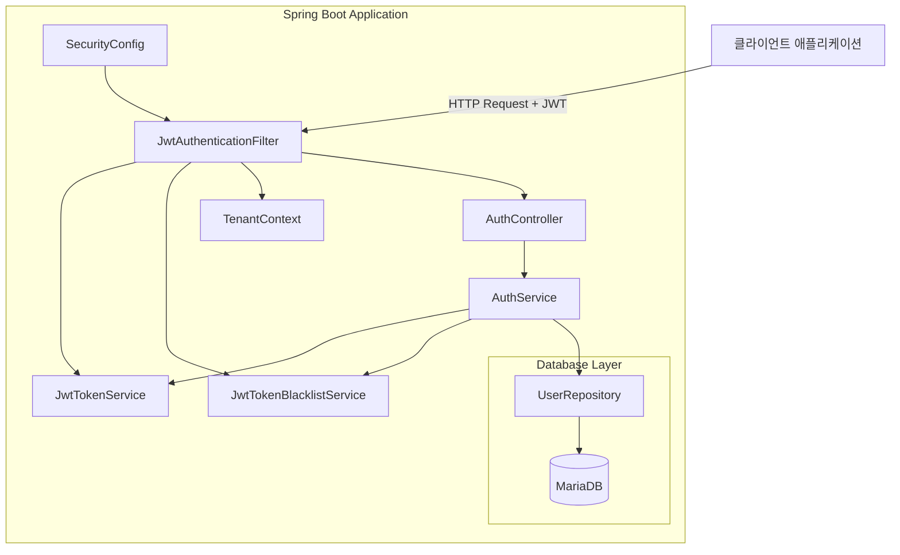
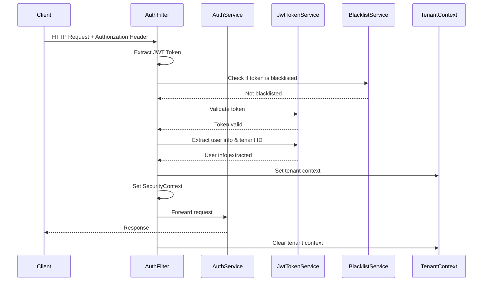

# JWT 토큰 시스템 완성 설계 문서

## 개요

SmartCON Lite의 JWT 토큰 기반 인증 시스템을 완성하여 안전하고 확장 가능한 인증 체계를 구축합니다. 기존에 구현된 JWT 토큰 서비스, 인증 필터, 블랙리스트 서비스를 기반으로 누락된 기능들을 보완하고 Spring Security 6.x와의 완전한 통합을 달성합니다.

## 아키텍처

### 전체 아키텍처 다이어그램



### 인증 플로우



## 컴포넌트 및 인터페이스

### 1. JWT 토큰 서비스 (JwtTokenService)

**역할**: JWT 토큰 생성, 검증, 클레임 추출을 담당하는 핵심 서비스

**주요 메서드**:
- `generateAccessToken(userId, tenantId, role, permissions)`: Access Token 생성
- `generateRefreshToken(userId, tenantId)`: Refresh Token 생성
- `validateToken(token)`: 토큰 유효성 검증
- `extractClaims(token)`: 토큰에서 클레임 추출
- `extractUserId(token)`: 사용자 ID 추출
- `extractTenantId(token)`: 테넌트 ID 추출
- `extractRole(token)`: 사용자 역할 추출
- `isAccessToken(token)`: Access Token 여부 확인
- `isRefreshToken(token)`: Refresh Token 여부 확인

**설정 속성**:
- `jwt.secret`: HMAC 비밀키 (개발용)
- `jwt.use-rsa`: RSA 사용 여부 (운영용)
- `jwt.access-token-expiration-minutes`: Access Token 만료 시간 (기본: 60분)
- `jwt.refresh-token-expiration-days`: Refresh Token 만료 시간 (기본: 7일)

### 2. 인증 서비스 (AuthService)

**역할**: 사용자 인증, 토큰 관리, 로그인/로그아웃 처리

**주요 메서드**:
- `login(LoginRequest)`: 사용자 로그인 처리
- `refreshToken(RefreshTokenRequest)`: 토큰 갱신 처리
- `logout(accessToken)`: 로그아웃 처리
- `validateToken(token)`: 토큰 검증
- `generateDevToken(role, tenantId)`: 개발용 토큰 생성

**인증 로직**:
1. 사용자 정보 조회 및 검증
2. 비밀번호 검증 (BCrypt)
3. 계정 상태 확인 (활성화, 잠금 여부)
4. JWT 토큰 생성
5. 권한 정보 포함

### 3. JWT 인증 필터 (JwtAuthenticationFilter)

**역할**: HTTP 요청에서 JWT 토큰을 검증하고 인증 정보를 설정

**처리 순서**:
1. Authorization 헤더에서 JWT 토큰 추출
2. 공개 경로 확인 (인증 불필요 경로 건너뛰기)
3. 토큰 블랙리스트 확인
4. JWT 토큰 유효성 검증
5. 토큰 타입 확인 (Access Token)
6. 사용자 정보 추출
7. 테넌트 컨텍스트 설정
8. SecurityContext에 인증 정보 설정
9. 요청 처리 후 테넌트 컨텍스트 정리

**공개 경로**:
- `/h2-console/**` (개발용)
- `/actuator/**` (모니터링)
- `/v1/auth/**` (인증 관련)
- `/v1/subscriptions/plans` (구독 플랜 조회)
- `/v1/subscriptions/create` (구독 신청)
- `/v1/subscriptions/current` (현재 구독 상태)

### 4. 토큰 블랙리스트 서비스 (JwtTokenBlacklistService)

**역할**: 로그아웃된 토큰을 관리하여 보안 강화

**주요 기능**:
- 메모리 기반 블랙리스트 (ConcurrentHashMap)
- 자동 만료 토큰 정리 (1시간마다)
- 토큰 블랙리스트 추가/확인
- 통계 정보 제공

**운영 환경 고려사항**:
- Redis 기반 분산 블랙리스트 권장
- 클러스터 환경에서 토큰 상태 동기화

### 5. 보안 설정 (SecurityConfig)

**역할**: Spring Security 6.x 기반 보안 설정

**주요 설정**:
- JWT 인증 필터 등록
- CORS 설정
- 세션 정책 (STATELESS)
- 권한 기반 접근 제어
- 보안 헤더 설정

**권한 매핑**:
- `/v1/admin/**`: ROLE_SUPER 필요
- `/v1/admin/subscriptions/**`: 구독 승인 권한
- `/v1/admin/auto-approval/**`: 자동 승인 규칙 관리
- `/v1/admin/notifications/**`: 알림 관리
- `/v1/admin/tenants/**`: 테넌트 관리

## 데이터 모델

### JWT 토큰 구조

**Access Token Claims**:
```json
{
  "sub": "사용자 ID",
  "tenant_id": "테넌트 ID",
  "role": "사용자 역할",
  "permissions": {
    "admin.read": true,
    "admin.write": true,
    "subscription.approve": true
  },
  "token_type": "access",
  "iss": "smartcon-lite",
  "aud": "smartcon-api",
  "iat": 1640995200,
  "exp": 1640998800
}
```

**Refresh Token Claims**:
```json
{
  "sub": "사용자 ID",
  "tenant_id": "테넌트 ID",
  "token_type": "refresh",
  "iss": "smartcon-lite",
  "aud": "smartcon-api",
  "iat": 1640995200,
  "exp": 1641600000
}
```

### 권한 매핑

**ROLE_SUPER (슈퍼관리자)**:
- `admin.read`, `admin.write`: 관리자 기능
- `subscription.approve`, `subscription.reject`: 구독 승인/거부
- `tenant.manage`: 테넌트 관리
- `user.manage`: 사용자 관리
- `system.monitor`: 시스템 모니터링

**ROLE_HQ (본사 관리자)**:
- `tenant.read`, `tenant.write`: 테넌트 정보 관리
- `user.read`, `user.write`: 사용자 관리
- `attendance.read`: 출근 기록 조회
- `contract.read`, `contract.write`: 계약 관리

**ROLE_SITE (현장 관리자)**:
- `site.read`, `site.write`: 현장 관리
- `attendance.read`, `attendance.write`: 출근 관리
- `worker.read`, `worker.write`: 작업자 관리
- `contract.read`: 계약 조회

**ROLE_TEAM (팀장)**:
- `team.read`, `team.write`: 팀 관리
- `attendance.read`: 출근 기록 조회
- `worker.read`: 작업자 조회

**ROLE_WORKER (작업자)**:
- `attendance.read`: 본인 출근 기록 조회
- `contract.read`: 본인 계약 조회
- `profile.read`, `profile.write`: 프로필 관리

## 정확성 속성

*속성은 시스템이 모든 유효한 실행에서 참이어야 하는 특성 또는 동작입니다. 속성은 인간이 읽을 수 있는 사양과 기계 검증 가능한 정확성 보장 사이의 다리 역할을 합니다.*

### JWT 토큰 서비스 초기화 속성

**속성 1: JWT 서비스 초기화 일관성**
*모든* JWT 서비스 설정에 대해, 비밀키와 만료 시간이 제공되면 서비스가 성공적으로 초기화되어야 합니다
**검증: 요구사항 1.1**

**속성 2: 개발 환경 알고리즘 선택**
*모든* 개발 환경 설정에 대해, use-rsa가 false로 설정되면 HMAC-SHA256 알고리즘이 사용되어야 합니다
**검증: 요구사항 1.2**

**속성 3: 운영 환경 알고리즘 선택**
*모든* 운영 환경 설정에 대해, use-rsa가 true로 설정되면 RSA256 알고리즘이 사용되어야 합니다
**검증: 요구사항 1.3**

**속성 4: 기본값 안전 동작**
*모든* 누락된 JWT 설정에 대해, 시스템이 안전한 기본값으로 초기화되어야 합니다
**검증: 요구사항 1.4**

### 사용자 인증 속성

**속성 5: 로그인 성공 시 토큰 생성**
*모든* 유효한 로그인 요청에 대해, Access Token과 Refresh Token이 생성되어야 합니다
**검증: 요구사항 2.1**

**속성 6: 로그인 실패 시 인증 거부**
*모든* 잘못된 로그인 요청에 대해, 인증 실패 응답이 반환되어야 합니다
**검증: 요구사항 2.2**

**속성 7: 계정 상태 확인**
*모든* 잠긴 또는 비활성 계정에 대해, 적절한 오류 메시지가 반환되어야 합니다
**검증: 요구사항 2.3**

**속성 8: 로그인 응답 완성성**
*모든* 성공한 로그인에 대해, 응답에 사용자 정보와 권한 정보가 포함되어야 합니다
**검증: 요구사항 2.4**

### 토큰 갱신 속성

**속성 9: 토큰 갱신 성공**
*모든* 유효한 Refresh Token에 대해, 새로운 Access Token이 생성되어야 합니다
**검증: 요구사항 3.1**

**속성 10: 토큰 갱신 실패 처리**
*모든* 만료되거나 유효하지 않은 Refresh Token에 대해, 토큰 갱신이 거부되어야 합니다
**검증: 요구사항 3.2**

**속성 11: 잘못된 토큰 타입 거부**
*모든* Access Token으로 갱신 시도에 대해, 적절한 오류 메시지가 반환되어야 합니다
**검증: 요구사항 3.3**

**속성 12: Refresh Token 재사용**
*모든* 성공한 토큰 갱신에 대해, 기존 Refresh Token이 재사용되어야 합니다
**검증: 요구사항 3.4**

### 로그아웃 보안 속성

**속성 13: 토큰 블랙리스트 추가**
*모든* 로그아웃 요청에 대해, Access Token이 블랙리스트에 추가되어야 합니다
**검증: 요구사항 4.1**

**속성 14: 블랙리스트 토큰 차단**
*모든* 블랙리스트된 토큰에 대해, API 접근이 차단되어야 합니다
**검증: 요구사항 4.2**

**속성 15: 만료 토큰 자동 정리**
*모든* 만료된 토큰에 대해, 블랙리스트에서 자동으로 제거되어야 합니다
**검증: 요구사항 4.3**

**속성 16: 로그아웃 성공 응답**
*모든* 성공한 로그아웃에 대해, 성공 응답이 반환되어야 합니다
**검증: 요구사항 4.4**

### JWT 인증 필터 속성

**속성 17: 보호된 API 토큰 검증**
*모든* 보호된 API 요청에 대해, JWT 토큰이 검증되어야 합니다
**검증: 요구사항 5.1**

**속성 18: 인증 헤더 오류 처리**
*모든* 잘못된 Authorization 헤더에 대해, 401 Unauthorized 응답이 반환되어야 합니다
**검증: 요구사항 5.2**

**속성 19: 유효 토큰 인증 설정**
*모든* 유효한 토큰에 대해, SecurityContext에 인증 정보가 설정되어야 합니다
**검증: 요구사항 5.3**

**속성 20: 공개 경로 토큰 건너뛰기**
*모든* 공개 경로 요청에 대해, 토큰 검증이 건너뛰어져야 합니다
**검증: 요구사항 5.4**

### 역할 기반 접근 제어 속성

**속성 21: 슈퍼관리자 권한 확인**
*모든* 슈퍼관리자 API 접근에 대해, ROLE_SUPER 권한이 확인되어야 합니다
**검증: 요구사항 6.1**

**속성 22: 권한 부족 접근 거부**
*모든* 권한 부족 사용자에 대해, 403 Forbidden 응답이 반환되어야 합니다
**검증: 요구사항 6.2**

**속성 23: 역할 정보 추출 정확성**
*모든* JWT 토큰에 대해, 정확한 역할 정보가 추출되어야 합니다
**검증: 요구사항 6.3**

**속성 24: 권한 변경 반영**
*모든* 권한 변경에 대해, 새로운 토큰에 업데이트된 권한이 포함되어야 합니다
**검증: 요구사항 6.4**

### 테넌트 컨텍스트 속성

**속성 25: 테넌트 컨텍스트 설정**
*모든* 테넌트 ID가 포함된 토큰에 대해, TenantContext에 테넌트 ID가 설정되어야 합니다
**검증: 요구사항 7.1**

**속성 26: 테넌트 컨텍스트 정리**
*모든* 요청 처리 완료에 대해, TenantContext가 정리되어야 합니다
**검증: 요구사항 7.2**

**속성 27: 유효하지 않은 테넌트 거부**
*모든* 유효하지 않은 테넌트 ID에 대해, 인증이 거부되어야 합니다
**검증: 요구사항 7.3**

**속성 28: 테넌트 기반 쿼리 필터링**
*모든* 테넌트 컨텍스트 설정에 대해, 데이터베이스 쿼리가 해당 테넌트로 필터링되어야 합니다
**검증: 요구사항 7.4**

### 개발용 도구 속성

**속성 29: 개발용 토큰 생성**
*모든* 개발용 토큰 생성 요청에 대해, 지정된 역할과 테넌트로 토큰이 생성되어야 합니다
**검증: 요구사항 8.1**

**속성 30: 역할 기본값 처리**
*모든* 역할 파라미터 누락에 대해, ROLE_SUPER가 기본값으로 사용되어야 합니다
**검증: 요구사항 8.2**

**속성 31: 테넌트 기본값 처리**
*모든* 테넌트 파라미터 누락에 대해, dev-tenant가 기본값으로 사용되어야 합니다
**검증: 요구사항 8.3**

**속성 32: 개발용 토큰 형식 일관성**
*모든* 개발용 토큰에 대해, 실제 JWT 토큰과 동일한 형식이어야 합니다
**검증: 요구사항 8.4**

### 토큰 검증 API 속성

**속성 33: 토큰 검증 수행**
*모든* 토큰 검증 API 호출에 대해, 토큰의 유효성이 검사되어야 합니다
**검증: 요구사항 9.1**

**속성 34: 유효 토큰 검증 결과**
*모든* 유효한 토큰에 대해, true가 반환되어야 합니다
**검증: 요구사항 9.2**

**속성 35: 무효 토큰 검증 결과**
*모든* 유효하지 않은 토큰에 대해, false가 반환되어야 합니다
**검증: 요구사항 9.3**

**속성 36: 토큰 형식 오류 처리**
*모든* 잘못된 토큰 형식에 대해, 적절한 오류 메시지가 반환되어야 합니다
**검증: 요구사항 9.4**

### Spring Security 통합 속성

**속성 37: JWT 필터 등록**
*모든* Spring Security 초기화에 대해, JWT 인증 필터가 등록되어야 합니다
**검증: 요구사항 10.1**

**속성 38: CORS 헤더 설정**
*모든* CORS 요청에 대해, 적절한 CORS 헤더가 설정되어야 합니다
**검증: 요구사항 10.2**

**속성 39: 보안 헤더 설정**
*모든* HTTP 응답에 대해, HSTS와 Content-Type 보안 헤더가 설정되어야 합니다
**검증: 요구사항 10.3**

**속성 40: STATELESS 세션 정책**
*모든* Spring Security 설정에 대해, STATELESS 모드로 동작해야 합니다
**검증: 요구사항 10.4**

## 오류 처리

### JWT 토큰 관련 오류

**토큰 생성 실패**:
- 원인: 잘못된 사용자 정보, 권한 정보 누락
- 처리: IllegalArgumentException 발생, 적절한 오류 메시지 반환
- 로깅: 오류 원인과 사용자 정보 기록

**토큰 검증 실패**:
- 원인: 만료된 토큰, 잘못된 서명, 형식 오류
- 처리: 401 Unauthorized 응답, SecurityContext 설정 안 함
- 로깅: 토큰 검증 실패 원인 기록

**토큰 블랙리스트 오류**:
- 원인: 메모리 부족, 동시성 문제
- 처리: 로그아웃 실패 응답, 토큰 유효성 유지
- 로깅: 블랙리스트 오류 상세 정보 기록

### 인증 관련 오류

**로그인 실패**:
- 원인: 잘못된 자격 증명, 계정 잠금, 비활성 계정
- 처리: 구체적인 오류 메시지, 실패 횟수 증가
- 로깅: 로그인 시도 정보와 실패 원인 기록

**권한 부족**:
- 원인: 역할 권한 부족, 테넌트 접근 권한 없음
- 처리: 403 Forbidden 응답, 접근 거부 메시지
- 로깅: 권한 부족 접근 시도 기록

**테넌트 컨텍스트 오류**:
- 원인: 유효하지 않은 테넌트 ID, 컨텍스트 설정 실패
- 처리: 401 Unauthorized 응답, 인증 거부
- 로깅: 테넌트 컨텍스트 오류 정보 기록

## 테스팅 전략

### 이중 테스팅 접근법

**단위 테스트**:
- JWT 토큰 서비스 메서드별 테스트
- 인증 서비스 로직 테스트
- 필터 동작 테스트
- 특정 예제와 엣지 케이스 검증

**속성 기반 테스트**:
- 모든 입력에 대한 보편적 속성 검증
- 최소 100회 반복 실행
- 랜덤 입력 생성을 통한 포괄적 커버리지
- 각 속성은 설계 문서의 속성과 연결

**속성 기반 테스트 설정**:
- 테스트 프레임워크: jqwik (Java Property-Based Testing)
- 반복 횟수: 최소 100회
- 태그 형식: **Feature: jwt-token-system-completion, Property {번호}: {속성 텍스트}**
- 각 정확성 속성은 단일 속성 기반 테스트로 구현

**통합 테스트**:
- Spring Security와 JWT 필터 통합 테스트
- 전체 인증 플로우 테스트
- 멀티테넌트 환경 테스트
- API 엔드포인트별 권한 테스트