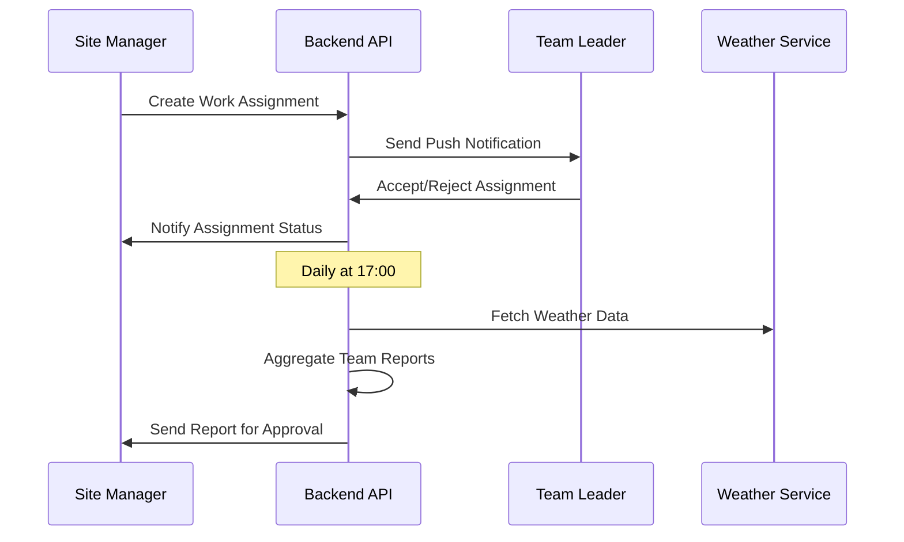
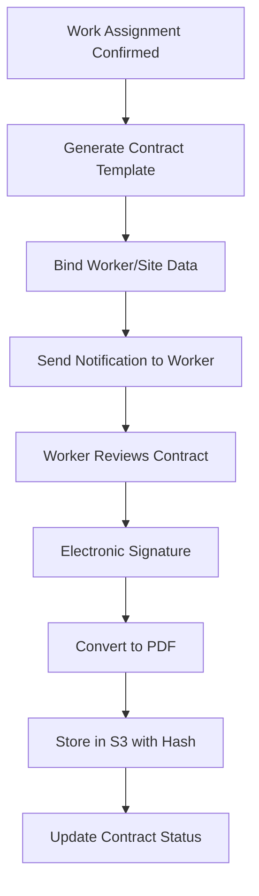
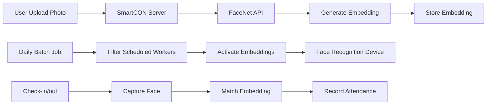

# SmartCON Lite MVP 완성 설계 문서

## 시스템 아키텍처

### 전체 시스템 구조
```
┌─────────────────┐    ┌─────────────────┐    ┌─────────────────┐
│   Mobile App    │    │   Web Frontend  │    │  Super Admin    │
│   (Capacitor)   │    │    (React)      │    │   Dashboard     │
└─────────┬───────┘    └─────────┬───────┘    └─────────┬───────┘
          │                      │                      │
          └──────────────────────┼──────────────────────┘
                                 │
                    ┌─────────────┴───────────┐
                    │    API Gateway          │
                    │   (Spring Boot)         │
                    └─────────────┬───────────┘
                                  │
          ┌───────────────────────┼───────────────────────┐
          │                       │                       │
    ┌─────┴─────┐         ┌───────┴───────┐       ┌───────┴───────┐
    │  MariaDB  │         │   External    │       │    File       │
    │ Database  │         │     APIs      │       │   Storage     │
    └───────────┘         └───────────────┘       └───────────────┘
                          │ 국세청 API    │       │ Profile Images│
                          │ Weather API   │       │ Contract PDFs │
                          │ SMS Gateway   │       │ Attendance    │
                          └───────────────┘       └───────────────┘
```

### 기술 스택 상세

#### 백엔드 (Spring Boot 3.3.x)
- **언어**: Java 17 LTS
- **프레임워크**: Spring Boot 3.3.x
- **보안**: Spring Security 6.x + JWT
- **데이터베이스**: MariaDB 10.11 + JPA/Hibernate
- **마이그레이션**: Flyway
- **테스트**: JUnit 5 + Testcontainers
- **문서화**: Swagger/OpenAPI 3.0

#### 프론트엔드 (React 18)
- **언어**: TypeScript 5.x
- **프레임워크**: React 18 + Vite 5
- **UI 라이브러리**: Shadcn/UI + Tailwind CSS
- **상태 관리**: Zustand + TanStack Query
- **라우팅**: Wouter
- **테스트**: Vitest + React Testing Library + Playwright

#### 모바일 앱 (Capacitor 6.x)
- **기반**: React + TypeScript (웹 기술 재사용)
- **네이티브 브릿지**: Capacitor 6.x
- **플러그인**: Camera, Geolocation, Push Notifications, Biometric Auth
- **빌드**: iOS/Android 네이티브 앱

## 데이터베이스 설계

### 핵심 엔티티 관계도
```
┌─────────────┐     ┌─────────────┐     ┌─────────────┐
│   Tenant    │────▶│    User     │────▶│ Attendance  │
│             │     │             │     │             │
│ - id        │     │ - id        │     │ - id        │
│ - name      │     │ - tenant_id │     │ - user_id   │
│ - status    │     │ - email     │     │ - check_in  │
│ - plan      │     │ - role      │     │ - check_out │
└─────────────┘     │ - face_data │     │ - location  │
                    └─────────────┘     └─────────────┘
        │                   │
        ▼                   ▼
┌─────────────┐     ┌─────────────┐
│Subscription │     │  Contract   │
│             │     │             │
│ - id        │     │ - id        │
│ - tenant_id │     │ - user_id   │
│ - status    │     │ - pdf_path  │
│ - plan_type │     │ - signed_at │
│ - start_date│     │ - status    │
└─────────────┘     └─────────────┘
```

### 마이그레이션 스크립트 구조
```
db/migration/
├── V1__Create_base_tables.sql
├── V2__Create_tenant_tables.sql
├── V3__Create_user_tables.sql
├── V4__Create_attendance_tables.sql
├── V5__Create_subscription_tables.sql
├── V6__Create_contract_tables.sql
├── V7__Add_indexes.sql
└── V8__Insert_initial_data.sql
```

## API 설계

### 인증 API
```
POST /api/auth/login
POST /api/auth/refresh
POST /api/auth/logout
POST /api/auth/register
```

### 사용자 관리 API
```
GET    /api/users
POST   /api/users
GET    /api/users/{id}
PUT    /api/users/{id}
DELETE /api/users/{id}
POST   /api/users/{id}/upload-face
```

### 테넌트 관리 API
```
GET    /api/tenants
POST   /api/tenants
GET    /api/tenants/{id}
PUT    /api/tenants/{id}
POST   /api/tenants/verify-business-number
```

### 구독 관리 API
```
GET    /api/subscriptions
POST   /api/subscriptions
GET    /api/subscriptions/{id}
PUT    /api/subscriptions/{id}/approve
PUT    /api/subscriptions/{id}/reject
PUT    /api/subscriptions/{id}/suspend
```

### 출입 관리 API
```
GET    /api/attendance
POST   /api/attendance/check-in
POST   /api/attendance/check-out
GET    /api/attendance/today
GET    /api/attendance/report
```

### 계약 관리 API
```
GET    /api/contracts
POST   /api/contracts
GET    /api/contracts/{id}
POST   /api/contracts/{id}/sign
GET    /api/contracts/{id}/pdf
```

## 보안 설계

### JWT 토큰 구조
```json
{
  "header": {
    "alg": "RS256",
    "typ": "JWT"
  },
  "payload": {
    "sub": "user_id",
    "tenant_id": "tenant_id",
    "role": "ROLE_USER",
    "permissions": ["READ_ATTENDANCE", "WRITE_ATTENDANCE"],
    "iat": 1640995200,
    "exp": 1640998800
  }
}
```

### 권한 매트릭스
| 역할 | 사용자 관리 | 출입 관리 | 계약 관리 | 구독 관리 | 시스템 관리 |
|------|-------------|-----------|-----------|-----------|-------------|
| SUPER_ADMIN | ✓ | ✓ | ✓ | ✓ | ✓ |
| HQ_ADMIN | ✓ | ✓ | ✓ | ✗ | ✗ |
| SITE_MANAGER | ✓ | ✓ | ✓ | ✗ | ✗ |
| TEAM_LEADER | ✗ | ✓ | ✗ | ✗ | ✗ |
| WORKER | ✗ | ✓ | ✓ | ✗ | ✗ |

### 다중 테넌트 격리
```java
@Entity
@FilterDef(name = "tenantFilter", parameters = @ParamDef(name = "tenantId", type = "string"))
@Filter(name = "tenantFilter", condition = "tenant_id = :tenantId")
public class BaseTenantEntity {
    @Column(name = "tenant_id", nullable = false)
    private String tenantId;
    
    // 기타 공통 필드
}
```

## 프론트엔드 설계

### 컴포넌트 구조
```
src/
├── components/
│   ├── ui/                 # Shadcn/UI 기본 컴포넌트
│   ├── layout/             # 레이아웃 컴포넌트
│   ├── forms/              # 폼 컴포넌트
│   └── charts/             # 차트 컴포넌트
├── pages/
│   ├── auth/               # 인증 페이지
│   ├── super/              # 슈퍼관리자 페이지
│   ├── hq/                 # 본사관리자 페이지
│   ├── site/               # 현장관리자 페이지
│   └── worker/             # 작업자 페이지
├── hooks/
│   ├── useAuth.ts          # 인증 훅
│   ├── useApi.ts           # API 호출 훅
│   └── useWebSocket.ts     # 실시간 통신 훅
├── stores/
│   ├── authStore.ts        # 인증 상태
│   ├── userStore.ts        # 사용자 상태
│   └── tenantStore.ts      # 테넌트 상태
└── lib/
    ├── api.ts              # API 클라이언트
    ├── auth.ts             # 인증 유틸리티
    └── utils.ts            # 공통 유틸리티
```

### 상태 관리 설계
```typescript
// 인증 스토어
interface AuthStore {
  user: User | null;
  token: string | null;
  isAuthenticated: boolean;
  login: (credentials: LoginCredentials) => Promise<void>;
  logout: () => void;
  refreshToken: () => Promise<void>;
}

// API 클라이언트
class ApiClient {
  private baseURL: string;
  private token: string | null = null;
  
  async request<T>(endpoint: string, options?: RequestOptions): Promise<T> {
    // JWT 토큰 자동 첨부
    // 에러 처리
    // 토큰 갱신 로직
  }
}
```

## 모바일 앱 설계

### Capacitor 플러그인 구성
```typescript
// capacitor.config.ts
import { CapacitorConfig } from '@capacitor/cli';

const config: CapacitorConfig = {
  appId: 'com.smartcon.lite',
  appName: 'SmartCON Lite',
  webDir: 'dist',
  plugins: {
    Camera: {
      permissions: ['camera']
    },
    Geolocation: {
      permissions: ['location']
    },
    PushNotifications: {
      presentationOptions: ['badge', 'sound', 'alert']
    },
    BiometricAuth: {
      reason: '생체 인증을 통해 안전하게 로그인하세요'
    }
  }
};
```

### 네이티브 기능 통합
```typescript
// 얼굴 인식 출입
async function checkInWithFace() {
  const photo = await Camera.getPhoto({
    quality: 90,
    allowEditing: false,
    resultType: CameraResultType.Base64
  });
  
  const location = await Geolocation.getCurrentPosition();
  
  return api.post('/attendance/check-in', {
    faceImage: photo.base64String,
    location: {
      latitude: location.coords.latitude,
      longitude: location.coords.longitude
    }
  });
}
```

## 외부 API 연동 설계

### 사업자등록번호 인증
```java
@Service
public class BusinessNumberVerificationService {
    
    @Value("${external.api.business-verification.url}")
    private String apiUrl;
    
    @Value("${external.api.business-verification.key}")
    private String apiKey;
    
    public BusinessVerificationResult verify(String businessNumber) {
        // 국세청 API 호출
        // 결과 캐싱
        // 에러 처리 및 재시도
    }
}
```

### 날씨 API 연동
```java
@Service
public class WeatherService {
    
    public WeatherInfo getCurrentWeather(double latitude, double longitude) {
        // OpenWeatherMap API 호출
        // 작업 보고서에 날씨 정보 포함
    }
}
```

## 테스트 전략

### 백엔드 테스트
```java
// 통합 테스트
@SpringBootTest
@Testcontainers
class UserControllerIntegrationTest {
    
    @Container
    static MariaDBContainer<?> mariaDB = new MariaDBContainer<>("mariadb:10.11");
    
    @Test
    void shouldCreateUser() {
        // Given
        CreateUserRequest request = new CreateUserRequest();
        
        // When
        ResponseEntity<User> response = restTemplate.postForEntity("/api/users", request, User.class);
        
        // Then
        assertThat(response.getStatusCode()).isEqualTo(HttpStatus.CREATED);
    }
}
```

### 프론트엔드 테스트
```typescript
// E2E 테스트
test('사용자 로그인 플로우', async ({ page }) => {
  await page.goto('/login');
  await page.fill('[data-testid=email]', 'test@example.com');
  await page.fill('[data-testid=password]', 'password');
  await page.click('[data-testid=login-button]');
  
  await expect(page).toHaveURL('/dashboard');
  await expect(page.locator('[data-testid=user-name]')).toBeVisible();
});
```

## 배포 설계

### Docker 컨테이너화
```dockerfile
# 백엔드 Dockerfile
FROM openjdk:17-jre-slim
COPY target/smartcon-backend.jar app.jar
EXPOSE 8080
ENTRYPOINT ["java", "-jar", "/app.jar"]

# 프론트엔드 Dockerfile
FROM nginx:alpine
COPY dist/ /usr/share/nginx/html/
COPY nginx.conf /etc/nginx/nginx.conf
EXPOSE 80
```

### Docker Compose 구성
```yaml
version: '3.8'
services:
  backend:
    build: ./backend
    ports:
      - "8080:8080"
    environment:
      - SPRING_PROFILES_ACTIVE=prod
      - DB_HOST=mariadb
    depends_on:
      - mariadb
      
  frontend:
    build: ./frontend
    ports:
      - "80:80"
    depends_on:
      - backend
      
  mariadb:
    image: mariadb:10.11
    environment:
      - MYSQL_ROOT_PASSWORD=rootpassword
      - MYSQL_DATABASE=smartcon
    volumes:
      - mariadb_data:/var/lib/mysql
      
volumes:
  mariadb_data:
```

## 인트로 페이지 및 랜딩 시스템 설계

### 인트로 페이지 구조
```
/ (루트 경로)
├── 헤더 (네비게이션 메뉴)
├── 메인 섹션 (서비스 소개)
├── 기능 소개 섹션
├── 요금제 섹션
├── 문의 폼 섹션
└── 푸터
```

### 반응형 디자인
```typescript
// 브레이크포인트 정의
const breakpoints = {
  mobile: '375px',
  tablet: '768px',
  desktop: '1920px'
};

// 문의 폼 레이아웃
interface InquiryFormLayout {
  mobile: 'single-column';
  desktop: 'two-column';
  fields: {
    company: string;
    contact: string;
    email: string;
    phone: string;
    inquiry: string;
    privacy: boolean;
    marketing: boolean;
  };
}
```

## 작업 배정 및 일보 시스템 설계

### 작업 배정 플로우


### 일보 데이터 모델
```java
@Entity
@Table(name = "daily_reports")
public class DailyReport extends BaseTenantEntity {
    @Id
    @GeneratedValue(strategy = GenerationType.IDENTITY)
    private Long id;
    
    @ManyToOne(fetch = FetchType.LAZY)
    @JoinColumn(name = "site_id", nullable = false)
    private Site site;
    
    @Column(name = "report_date", nullable = false)
    private LocalDate reportDate;
    
    @Column(name = "weather_condition")
    private String weatherCondition;
    
    @Column(name = "temperature")
    private Double temperature;
    
    @Column(name = "total_workers")
    private Integer totalWorkers;
    
    @Enumerated(EnumType.STRING)
    private ReportStatus status; // DRAFT, SUBMITTED, APPROVED
}
```

## 전자계약 시스템 설계

### 계약서 생성 및 서명 플로우


### 전자서명 구현
```typescript
// Canvas 기반 전자서명
interface ElectronicSignature {
  canvas: HTMLCanvasElement;
  context: CanvasRenderingContext2D;
  isDrawing: boolean;
  
  startDrawing(event: MouseEvent | TouchEvent): void;
  draw(event: MouseEvent | TouchEvent): void;
  stopDrawing(): void;
  clearSignature(): void;
  getSignatureData(): string; // Base64 이미지 데이터
}

// 계약서 PDF 생성
interface ContractPDFGenerator {
  template: ContractTemplate;
  workerData: WorkerData;
  siteData: SiteData;
  signature: string;
  
  generatePDF(): Promise<Buffer>;
  calculateHash(pdfBuffer: Buffer): string;
}
```

## FaceNet 안면인식 연동 설계

### 안면인식 데이터 파이프라인


### FaceNet API 클라이언트
```java
@Service
public class FaceNetService {
    
    @Value("${facenet.api.url}")
    private String faceNetApiUrl;
    
    @Value("${facenet.api.key}")
    private String apiKey;
    
    public FaceEmbeddingResult generateEmbedding(MultipartFile faceImage) {
        // FaceNet API 호출
        // 임베딩 생성 및 품질 검증
        // 결과 반환
    }
    
    public FaceMatchResult matchFace(String faceImageBase64, List<FaceEmbedding> activeEmbeddings) {
        // 얼굴 매칭 수행
        // 신뢰도 점수 계산
        // 매칭 결과 반환
    }
    
    @Scheduled(cron = "0 0 0 * * *") // 매일 자정
    public void activateDailyEmbeddings() {
        // 당일 작업 예정자 필터링
        // 임베딩 활성화
        // 안면인식기에 데이터 전송
    }
}
```

## 딥링크 및 모바일 최적화 설계

### 딥링크 구현
```typescript
// Capacitor 딥링크 설정
import { App } from '@capacitor/app';

interface DeepLinkHandler {
  handleInvitationLink(url: string): void;
  handleTeamJoinLink(url: string): void;
  handleContractSignLink(url: string): void;
}

// URL 스키마 정의
const deepLinkSchemas = {
  invitation: 'smartcon://invite/{token}',
  teamJoin: 'smartcon://team/join/{teamId}',
  contract: 'smartcon://contract/sign/{contractId}'
};
```

### PWA 설정
```json
// manifest.json
{
  "name": "SmartCON Lite",
  "short_name": "SmartCON",
  "description": "건설 현장 인력 관리 시스템",
  "start_url": "/",
  "display": "standalone",
  "background_color": "#FAFAFA",
  "theme_color": "#71AA44",
  "icons": [
    {
      "src": "/icons/icon-192.png",
      "sizes": "192x192",
      "type": "image/png"
    }
  ]
}
```

## 다국어 및 접근성 설계

### i18n 구현
```typescript
// 다국어 리소스 구조
interface I18nResources {
  ko: {
    common: {
      login: '로그인';
      logout: '로그아웃';
      save: '저장';
      cancel: '취소';
    };
    dashboard: {
      title: '대시보드';
      attendance: '출역 현황';
    };
  };
  en: {
    common: {
      login: 'Login';
      logout: 'Logout';
      save: 'Save';
      cancel: 'Cancel';
    };
    dashboard: {
      title: 'Dashboard';
      attendance: 'Attendance Status';
    };
  };
}
```

### 접근성 구현
```typescript
// ARIA 라벨 및 키보드 네비게이션
interface AccessibilityFeatures {
  ariaLabels: Record<string, string>;
  keyboardNavigation: boolean;
  screenReaderSupport: boolean;
  colorContrastRatio: number; // 최소 4.5:1
  touchTargetSize: number; // 최소 44px
}

// 색상 대비 검증
const colorContrast = {
  background: '#FAFAFA',
  text: '#262626',
  primary: '#71AA44',
  secondary: '#737373',
  ratio: calculateContrastRatio('#262626', '#FAFAFA') // 4.5:1 이상
};
```

## 성능 최적화

### 백엔드 최적화
- 데이터베이스 인덱스 최적화
- JPA 쿼리 최적화 (N+1 문제 해결)
- 캐싱 전략 (Redis 도입 고려)
- 커넥션 풀 튜닝

### 프론트엔드 최적화
- 코드 스플리팅 (React.lazy)
- 이미지 최적화 및 지연 로딩
- API 응답 캐싱 (TanStack Query)
- 번들 크기 최적화

### 모바일 앱 최적화
- 오프라인 데이터 동기화
- 이미지 압축 및 캐싱
- 배터리 사용량 최적화
- 네트워크 사용량 최소화

## 모니터링 및 로깅

### 애플리케이션 모니터링
```java
// 헬스 체크 엔드포인트
@RestController
public class HealthController {
    
    @GetMapping("/health")
    public ResponseEntity<Map<String, String>> health() {
        Map<String, String> status = new HashMap<>();
        status.put("status", "UP");
        status.put("database", checkDatabaseConnection());
        status.put("external-apis", checkExternalApis());
        return ResponseEntity.ok(status);
    }
}
```

### 구조화된 로깅
```java
// 로그 구조
{
  "timestamp": "2025-01-06T10:30:00Z",
  "level": "INFO",
  "service": "smartcon-backend",
  "tenant_id": "tenant_123",
  "user_id": "user_456",
  "action": "USER_LOGIN",
  "message": "User logged in successfully",
  "duration_ms": 150
}
```

이 설계 문서는 SmartCON Lite MVP 완성을 위한 기술적 가이드라인을 제공하며, 2월 15일 목표 달성을 위한 구체적인 구현 방향을 제시합니다.