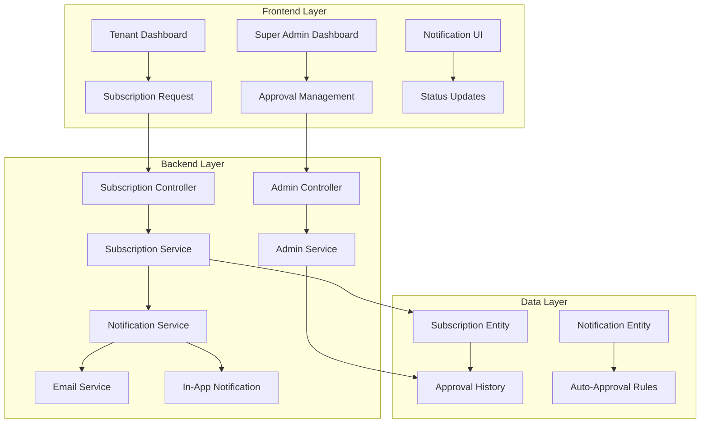
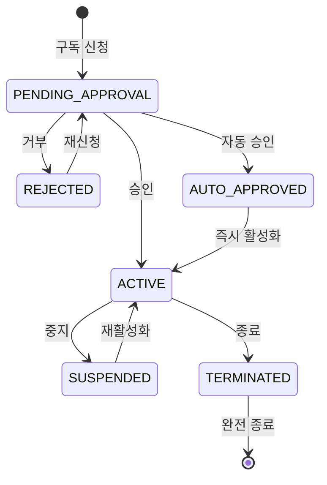

# Design Document

## Overview

SmartCON Lite 구독 시스템에 슈퍼관리자 승인 워크플로우를 추가하여 구독 신청의 품질 관리와 체계적인 고객 관리를 구현합니다. 기존 즉시 활성화 방식에서 승인 기반 활성화로 변경하고, 슈퍼관리자가 구독을 관리할 수 있는 포괄적인 기능을 제공합니다.

## Architecture

### 시스템 구성 요소



### 승인 워크플로우



## Components and Interfaces

### 1. 구독 상태 확장

기존 `SubscriptionStatus` enum에 새로운 상태 추가:

```java
public enum SubscriptionStatus {
    PENDING_APPROVAL,    // 승인 대기 (신규)
    REJECTED,           // 승인 거부 (신규)
    AUTO_APPROVED,      // 자동 승인 (신규)
    ACTIVE,             // 활성 (기존)
    SUSPENDED,          // 일시 중지 (기존)
    CANCELLED,          // 해지됨 (기존)
    EXPIRED,            // 만료됨 (기존)
    TERMINATED,         // 종료됨 (신규)
    TRIAL               // 체험판 (기존)
}
```

### 2. 승인 이력 엔티티

```java
@Entity
@Table(name = "subscription_approvals")
public class SubscriptionApproval extends BaseEntity {
    private Long id;
    private Long subscriptionId;
    private Long adminId;
    private SubscriptionStatus fromStatus;
    private SubscriptionStatus toStatus;
    private String reason;
    private LocalDateTime processedAt;
    private ApprovalAction action;
}

public enum ApprovalAction {
    APPROVE, REJECT, SUSPEND, TERMINATE, REACTIVATE
}
```

### 3. 자동 승인 규칙 엔티티

```java
@Entity
@Table(name = "auto_approval_rules")
public class AutoApprovalRule extends BaseEntity {
    private Long id;
    private String ruleName;
    private Boolean isActive;
    private String planIds;              // JSON 배열
    private Boolean verifiedTenantsOnly;
    private String paymentMethods;       // JSON 배열
    private BigDecimal maxAmount;
    private Integer priority;
}
```

### 4. 알림 엔티티

```java
@Entity
@Table(name = "notifications")
public class Notification extends BaseEntity {
    private Long id;
    private Long recipientId;
    private NotificationType type;
    private String title;
    private String message;
    private String relatedEntityType;
    private Long relatedEntityId;
    private Boolean isRead;
    private LocalDateTime readAt;
}

public enum NotificationType {
    SUBSCRIPTION_REQUEST, SUBSCRIPTION_APPROVED, 
    SUBSCRIPTION_REJECTED, SUBSCRIPTION_SUSPENDED,
    SUBSCRIPTION_TERMINATED, APPROVAL_REMINDER
}
```

### 5. 서비스 인터페이스

#### SubscriptionApprovalService

```java
public interface SubscriptionApprovalService {
    // 승인 관련
    SubscriptionDto approveSubscription(Long subscriptionId, String reason);
    SubscriptionDto rejectSubscription(Long subscriptionId, String reason);
    
    // 관리 기능
    SubscriptionDto suspendSubscription(Long subscriptionId, String reason);
    SubscriptionDto terminateSubscription(Long subscriptionId, String reason);
    SubscriptionDto reactivateSubscription(Long subscriptionId, String reason);
    
    // 조회 기능
    Page<SubscriptionDto> getPendingApprovals(Pageable pageable);
    List<SubscriptionApprovalDto> getApprovalHistory(Long subscriptionId);
    
    // 자동 승인
    boolean checkAutoApproval(CreateSubscriptionRequest request);
    SubscriptionDto processAutoApproval(CreateSubscriptionRequest request);
}
```

#### NotificationService

```java
public interface NotificationService {
    // 알림 발송
    void sendSubscriptionRequestNotification(Long subscriptionId);
    void sendApprovalResultNotification(Long subscriptionId, boolean approved, String reason);
    void sendReminderNotifications();
    
    // 알림 관리
    Page<NotificationDto> getNotifications(Long userId, Pageable pageable);
    void markAsRead(Long notificationId);
    void markAllAsRead(Long userId);
}
```

### 6. 컨트롤러 확장

#### SuperAdminController 확장

```java
@RestController
@RequestMapping("/api/v1/admin/subscriptions")
public class SubscriptionApprovalController {
    
    @GetMapping("/pending")
    public ResponseEntity<ApiResponse<Page<SubscriptionDto>>> getPendingApprovals(Pageable pageable);
    
    @PostMapping("/{subscriptionId}/approve")
    public ResponseEntity<ApiResponse<SubscriptionDto>> approveSubscription(
        @PathVariable Long subscriptionId, @RequestBody ApprovalRequest request);
    
    @PostMapping("/{subscriptionId}/reject")
    public ResponseEntity<ApiResponse<SubscriptionDto>> rejectSubscription(
        @PathVariable Long subscriptionId, @RequestBody ApprovalRequest request);
    
    @PostMapping("/{subscriptionId}/suspend")
    public ResponseEntity<ApiResponse<SubscriptionDto>> suspendSubscription(
        @PathVariable Long subscriptionId, @RequestBody ApprovalRequest request);
    
    @PostMapping("/{subscriptionId}/terminate")
    public ResponseEntity<ApiResponse<SubscriptionDto>> terminateSubscription(
        @PathVariable Long subscriptionId, @RequestBody ApprovalRequest request);
    
    @GetMapping("/{subscriptionId}/history")
    public ResponseEntity<ApiResponse<List<SubscriptionApprovalDto>>> getApprovalHistory(
        @PathVariable Long subscriptionId);
}
```

## Data Models

### 1. DTO 클래스

#### SubscriptionApprovalDto

```java
@Data
@Builder
public class SubscriptionApprovalDto {
    private Long id;
    private Long subscriptionId;
    private String adminName;
    private SubscriptionStatus fromStatus;
    private SubscriptionStatus toStatus;
    private String reason;
    private ApprovalAction action;
    private LocalDateTime processedAt;
}
```

#### ApprovalRequest

```java
@Data
@Valid
public class ApprovalRequest {
    @NotBlank(message = "사유는 필수입니다")
    @Size(max = 500, message = "사유는 500자 이내로 입력해주세요")
    private String reason;
}
```

#### NotificationDto

```java
@Data
@Builder
public class NotificationDto {
    private Long id;
    private NotificationType type;
    private String title;
    private String message;
    private String relatedEntityType;
    private Long relatedEntityId;
    private Boolean isRead;
    private LocalDateTime createdAt;
    private LocalDateTime readAt;
}
```

### 2. 데이터베이스 스키마 변경

#### 구독 테이블 수정

```sql
-- 기존 subscriptions 테이블에 컬럼 추가
ALTER TABLE subscriptions 
ADD COLUMN approval_requested_at TIMESTAMP,
ADD COLUMN approved_at TIMESTAMP,
ADD COLUMN approved_by BIGINT,
ADD COLUMN rejection_reason TEXT,
ADD COLUMN suspension_reason TEXT,
ADD COLUMN termination_reason TEXT;

-- 외래키 제약조건 추가
ALTER TABLE subscriptions 
ADD CONSTRAINT fk_subscriptions_approved_by 
FOREIGN KEY (approved_by) REFERENCES users(id);
```

#### 새 테이블 생성

```sql
-- 승인 이력 테이블
CREATE TABLE subscription_approvals (
    id BIGINT PRIMARY KEY AUTO_INCREMENT,
    subscription_id BIGINT NOT NULL,
    admin_id BIGINT NOT NULL,
    from_status VARCHAR(50) NOT NULL,
    to_status VARCHAR(50) NOT NULL,
    reason TEXT,
    action VARCHAR(50) NOT NULL,
    processed_at TIMESTAMP NOT NULL,
    created_at TIMESTAMP DEFAULT CURRENT_TIMESTAMP,
    updated_at TIMESTAMP DEFAULT CURRENT_TIMESTAMP ON UPDATE CURRENT_TIMESTAMP,
    FOREIGN KEY (subscription_id) REFERENCES subscriptions(id),
    FOREIGN KEY (admin_id) REFERENCES users(id)
);

-- 자동 승인 규칙 테이블
CREATE TABLE auto_approval_rules (
    id BIGINT PRIMARY KEY AUTO_INCREMENT,
    rule_name VARCHAR(100) NOT NULL,
    is_active BOOLEAN DEFAULT TRUE,
    plan_ids JSON,
    verified_tenants_only BOOLEAN DEFAULT FALSE,
    payment_methods JSON,
    max_amount DECIMAL(10,2),
    priority INT DEFAULT 0,
    created_at TIMESTAMP DEFAULT CURRENT_TIMESTAMP,
    updated_at TIMESTAMP DEFAULT CURRENT_TIMESTAMP ON UPDATE CURRENT_TIMESTAMP
);

-- 알림 테이블
CREATE TABLE notifications (
    id BIGINT PRIMARY KEY AUTO_INCREMENT,
    recipient_id BIGINT NOT NULL,
    type VARCHAR(50) NOT NULL,
    title VARCHAR(200) NOT NULL,
    message TEXT NOT NULL,
    related_entity_type VARCHAR(50),
    related_entity_id BIGINT,
    is_read BOOLEAN DEFAULT FALSE,
    read_at TIMESTAMP NULL,
    created_at TIMESTAMP DEFAULT CURRENT_TIMESTAMP,
    updated_at TIMESTAMP DEFAULT CURRENT_TIMESTAMP ON UPDATE CURRENT_TIMESTAMP,
    FOREIGN KEY (recipient_id) REFERENCES users(id)
);
```

## Correctness Properties

*A property is a characteristic or behavior that should hold true across all valid executions of a system-essentially, a formal statement about what the system should do. Properties serve as the bridge between human-readable specifications and machine-verifiable correctness guarantees.*

### Property 1: Subscription Request Creation
*For any* valid subscription request, creating the subscription should result in a subscription with PENDING_APPROVAL status
**Validates: Requirements 1.1**

### Property 2: Pending Subscription Access Control
*For any* subscription in PENDING_APPROVAL status, service access should be blocked for that tenant
**Validates: Requirements 1.2**

### Property 3: Pending Subscriptions Query
*For any* query for pending subscriptions, the result should contain all and only subscriptions with PENDING_APPROVAL status
**Validates: Requirements 1.3**

### Property 4: Subscription Approval State Transition
*For any* pending subscription, when approved by a super admin, the status should change to ACTIVE and service access should be enabled
**Validates: Requirements 1.4**

### Property 5: Subscription Rejection State Transition
*For any* pending subscription, when rejected by a super admin, the status should change to REJECTED and rejection reason should be recorded
**Validates: Requirements 1.5**

### Property 6: New Request Notification
*For any* new subscription request, notifications should be sent to all super admin users
**Validates: Requirements 2.1**

### Property 7: Approval Result Notification
*For any* subscription approval or rejection action, a notification should be sent to the requesting tenant
**Validates: Requirements 2.2**

### Property 8: Pending Subscription Reminders
*For any* subscription that has been pending for more than 24 hours, reminder notifications should be sent to super admins
**Validates: Requirements 2.3**

### Property 9: Subscription Suspension
*For any* active subscription, when suspended by a super admin, the status should change to SUSPENDED and service access should be disabled immediately
**Validates: Requirements 3.1**

### Property 10: Subscription Termination
*For any* subscription, when terminated by a super admin, the status should change to TERMINATED and service access should be permanently disabled
**Validates: Requirements 3.2**

### Property 11: Action Reason Recording
*For any* suspension or termination action, a reason must be provided and recorded with timestamp
**Validates: Requirements 3.3**

### Property 12: Suspended Subscription Reactivation
*For any* suspended subscription, reactivation by super admin approval should be allowed and should restore ACTIVE status
**Validates: Requirements 3.4**

### Property 13: Terminated Subscription Restrictions
*For any* terminated subscription, reactivation attempts should be blocked and new subscription request should be required
**Validates: Requirements 3.5**

### Property 14: Dashboard Subscription Counts
*For any* approval dashboard query, the displayed counts should match the actual number of subscriptions in each status (pending, active, suspended, terminated)
**Validates: Requirements 4.1**

### Property 15: Subscription Detail Display
*For any* subscription detail view, all required information (tenant info, plan details, request date, current status) should be present
**Validates: Requirements 4.2**

### Property 16: Subscription Filtering
*For any* subscription filter criteria (status, date range, tenant name), the results should contain only subscriptions matching all specified criteria
**Validates: Requirements 4.3**

### Property 17: Subscription Data Export
*For any* subscription data export, the generated CSV should contain all subscription details and match the source data
**Validates: Requirements 4.4**

### Property 18: Approval History Display
*For any* subscription, the approval history should display all status changes in chronological order with admin information
**Validates: Requirements 4.5**

### Property 19: Audit Log Creation
*For any* subscription status change, an audit log entry should be created with timestamp, admin ID, old status, new status, and reason
**Validates: Requirements 5.1**

### Property 20: Subscription History Chronology
*For any* subscription history query, status changes should be displayed in chronological order with responsible admin information
**Validates: Requirements 5.2**

### Property 21: System Integration Updates
*For any* subscription status change, related billing and access control systems should be updated immediately
**Validates: Requirements 5.3**

### Property 22: Audit Log Filtering
*For any* audit log query with filters (date range, admin, tenant, status change type), results should contain only entries matching all specified criteria
**Validates: Requirements 5.5**

### Property 23: Pending Status UI Behavior
*For any* tenant with PENDING_APPROVAL subscription, the system should display "승인 대기 중" message and block service access
**Validates: Requirements 6.1**

### Property 24: Rejected Status UI Behavior
*For any* tenant with REJECTED subscription, the system should display rejection reason and provide reapplication option
**Validates: Requirements 6.2**

### Property 25: Suspended Status UI Behavior
*For any* tenant with SUSPENDED subscription, the system should display suspension reason and contact information
**Validates: Requirements 6.3**

### Property 26: Terminated Status UI Behavior
*For any* tenant with TERMINATED subscription, the system should display termination notice and new subscription option
**Validates: Requirements 6.4**

### Property 27: Auto-Approval Rule Configuration
*For any* auto-approval rule configuration, the system should support criteria based on tenant verification status, plan type, and payment method
**Validates: Requirements 7.1**

### Property 28: Auto-Approval Processing and Logging
*For any* subscription request matching auto-approval criteria, the system should automatically approve and activate the subscription, and log the action with applied criteria
**Validates: Requirements 7.2, 7.3**

### Property 29: Auto-Approval Rule Application Timing
*For any* modification to auto-approval rules, changes should apply to new requests only and not affect existing pending requests
**Validates: Requirements 7.4**

### Property 30: Auto-Approval Disable Functionality
*For any* system configuration where auto-approval is disabled, all new subscription requests should go to manual approval process
**Validates: Requirements 7.5**

### Property 31: State Transition Validation
*For any* subscription status change attempt, invalid state transitions should be rejected according to business rules
**Validates: Requirements 8.3**

## Error Handling

### 1. 승인 프로세스 오류 처리

- **동시 승인 시도**: 낙관적 잠금을 사용하여 동시 승인 시도 방지
- **잘못된 상태 전환**: 비즈니스 규칙에 따른 상태 전환 검증
- **권한 부족**: 슈퍼관리자 권한 검증 및 적절한 오류 메시지 반환
- **존재하지 않는 구독**: 구독 ID 유효성 검증

### 2. 알림 시스템 오류 처리

- **알림 발송 실패**: 재시도 메커니즘 및 실패 로깅
- **수신자 없음**: 슈퍼관리자 부재 시 대체 알림 방안
- **네트워크 오류**: 이메일 발송 실패 시 인앱 알림으로 대체

### 3. 데이터 무결성 오류 처리

- **트랜잭션 실패**: 롤백 및 일관성 유지
- **외래키 제약조건 위반**: 적절한 오류 메시지 및 복구 방안
- **동시성 문제**: 버전 관리를 통한 충돌 해결

### 4. 자동 승인 오류 처리

- **규칙 평가 실패**: 수동 승인으로 폴백
- **규칙 충돌**: 우선순위에 따른 규칙 적용
- **설정 오류**: 기본값 적용 및 관리자 알림

## Testing Strategy

### 단위 테스트 (Unit Tests)

**테스트 범위:**
- 서비스 레이어 비즈니스 로직 검증
- 상태 전환 규칙 검증
- 권한 검증 로직
- 알림 발송 로직
- 자동 승인 규칙 평가

**주요 테스트 케이스:**
- 승인/거부 시 상태 변경 검증
- 잘못된 상태 전환 시도 시 예외 발생 확인
- 권한 없는 사용자의 승인 시도 차단
- 알림 템플릿 및 수신자 목록 검증

### 속성 기반 테스트 (Property-Based Tests)

**테스트 설정:**
- 최소 100회 반복 실행
- 각 속성 테스트는 설계 문서의 해당 속성 참조
- 태그 형식: **Feature: subscription-approval-workflow, Property {번호}: {속성명}**

**생성기 (Generators):**
- 구독 요청 데이터 생성기 (다양한 요금제, 테넌트 정보)
- 상태 전환 시나리오 생성기
- 알림 수신자 목록 생성기
- 자동 승인 규칙 생성기

**속성 테스트 예시:**
```java
@Test
@Tag("Feature: subscription-approval-workflow, Property 1: Subscription Request Creation")
void testSubscriptionRequestCreation() {
    // Property 1: 모든 유효한 구독 요청은 PENDING_APPROVAL 상태로 생성되어야 함
}

@Test
@Tag("Feature: subscription-approval-workflow, Property 4: Subscription Approval State Transition")
void testSubscriptionApprovalTransition() {
    // Property 4: 모든 대기 중인 구독은 승인 시 ACTIVE 상태로 변경되고 서비스 접근이 허용되어야 함
}
```

### 통합 테스트 (Integration Tests)

**테스트 범위:**
- API 엔드포인트 통합 테스트
- 데이터베이스 트랜잭션 테스트
- 알림 시스템 통합 테스트
- 외부 시스템 연동 테스트

**주요 시나리오:**
- 전체 승인 워크플로우 end-to-end 테스트
- 동시 승인 요청 처리 테스트
- 알림 발송 및 수신 확인 테스트
- 자동 승인 규칙 적용 테스트

### 성능 테스트

**테스트 시나리오:**
- 대량 구독 요청 처리 성능
- 승인 대시보드 로딩 성능
- 알림 발송 성능
- 데이터베이스 쿼리 최적화 검증

### 보안 테스트

**테스트 항목:**
- 권한 기반 접근 제어 검증
- SQL 인젝션 방지 확인
- 입력 데이터 검증 및 sanitization
- 세션 관리 및 인증 토큰 검증

## Implementation Notes

### 1. 기존 시스템과의 호환성

- 기존 `SubscriptionService`를 확장하여 승인 기능 추가
- 기존 API 엔드포인트는 유지하되 내부 로직 수정
- 데이터베이스 마이그레이션을 통한 점진적 업그레이드

### 2. 성능 최적화

- 승인 대기 목록 조회 시 인덱스 활용
- 알림 발송 시 비동기 처리
- 캐싱을 통한 자동 승인 규칙 성능 향상

### 3. 모니터링 및 로깅

- 모든 승인 액션에 대한 상세 로깅
- 성능 메트릭 수집 (승인 처리 시간, 대기 시간 등)
- 알림 발송 성공/실패 모니터링

### 4. 확장성 고려사항

- 마이크로서비스 아키텍처로의 분리 가능성
- 이벤트 기반 아키텍처 적용 고려
- 다중 지역 배포 시 데이터 동기화 방안