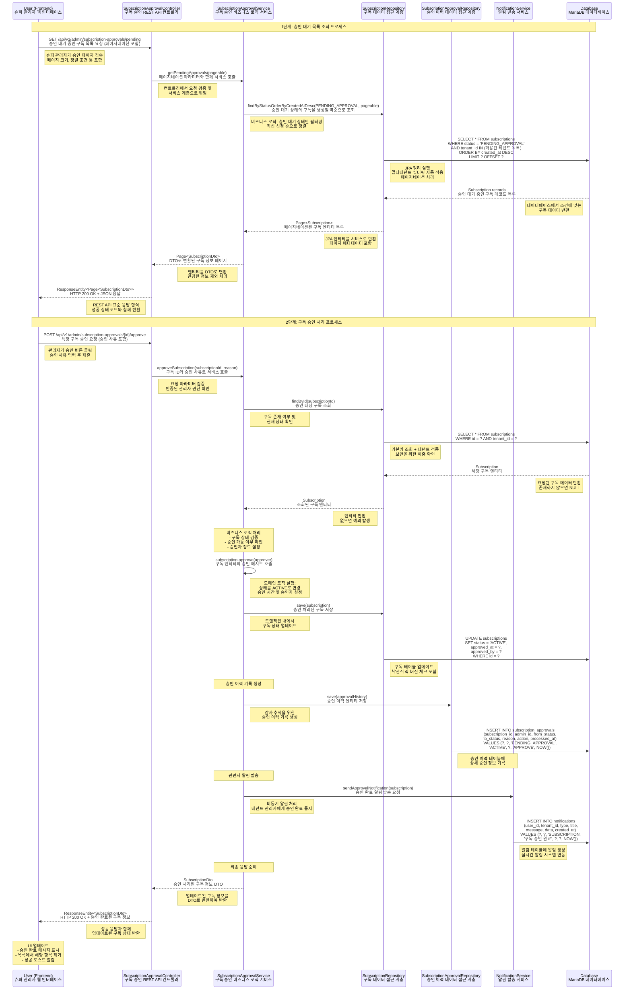

# SmartCON Lite 클래스 다이어그램

## 문서 개요
이 문서는 SmartCON Lite 시스템의 전체 클래스 구조와 컴포넌트 간의 관계를 시각적으로 표현한 클래스 다이어그램입니다.
각 도메인별로 세분화하여 시스템의 복잡성을 관리 가능한 단위로 분해하여 설명합니다.

## 전체 시스템 아키텍처


### 아키텍처 설명

#### Frontend Layer (프론트엔드 계층)
React 18 + TypeScript 기반의 사용자 인터페이스 계층으로, 모바일 우선 반응형 웹 애플리케이션을 구성합니다.

- **Pages (페이지 컴포넌트)**: 
  - 역할별 라우팅 기반의 페이지 컴포넌트들 (/hq, /site, /worker, /super)
  - 각 사용자 역할에 맞는 전용 대시보드 및 기능 페이지 제공
  - Wouter 라이브러리를 사용한 경량 클라이언트 사이드 라우팅

- **Components (UI 컴포넌트)**: 
  - Shadcn/UI + Tailwind CSS 기반의 재사용 가능한 UI 컴포넌트들
  - 디자인 시스템을 준수하는 일관된 사용자 인터페이스 요소
  - 접근성(Accessibility) 표준을 준수하는 컴포넌트 설계

- **Hooks (커스텀 훅)**: 
  - TanStack Query를 활용한 서버 상태 관리 및 API 호출 로직
  - 비즈니스 로직과 UI 로직의 분리를 통한 재사용성 향상
  - 캐싱, 에러 처리, 로딩 상태 관리 등의 공통 기능 제공

- **Stores (상태 관리)**: 
  - Zustand 기반의 경량 전역 상태 관리
  - 클라이언트 사이드 상태 (UI 상태, 사용자 설정 등) 관리
  - 서버 상태는 TanStack Query로 별도 관리하여 관심사 분리

#### Backend Layer (백엔드 계층)
Spring Boot 3.3.x + Java 17 기반의 서버 애플리케이션 계층으로, 레이어드 아키텍처 패턴을 적용합니다.

- **Controllers (REST API 컨트롤러)**: 
  - HTTP 요청을 처리하는 REST API 엔드포인트
  - 요청 검증, 응답 포맷팅, 예외 처리 등의 웹 계층 책임
  - Spring Security를 통한 인증/인가 처리 및 역할 기반 접근 제어

- **Services (비즈니스 로직)**: 
  - 핵심 비즈니스 로직을 담당하는 서비스 계층
  - 트랜잭션 관리, 도메인 규칙 적용, 외부 시스템 연동
  - 인터페이스와 구현체 분리를 통한 테스트 용이성 및 확장성 확보

- **Repositories (데이터 접근 계층)**: 
  - Spring Data JPA 기반의 데이터 접근 계층
  - 데이터베이스 CRUD 연산 및 복잡한 쿼리 처리
  - 멀티테넌트 지원을 위한 자동 테넌트 필터링 적용

- **Entities (도메인 엔티티)**: 
  - JPA 엔티티로 구현된 도메인 객체
  - 비즈니스 규칙과 데이터 무결성 제약 조건 포함
  - 멀티테넌트 아키텍처를 위한 BaseTenantEntity 상속 구조

#### Database Layer (데이터베이스 계층)
MariaDB 10.11 기반의 관계형 데이터베이스로, 멀티테넌트 SaaS 아키텍처를 지원합니다.

- **Tables (데이터베이스 테이블)**: 
  - 테넌트별 데이터 격리를 위한 tenant_id 기반 파티셔닝
  - 감사 추적을 위한 생성/수정 시간 자동 관리
  - 성능 최적화를 위한 적절한 인덱스 설계

## 1. Global 패키지 클래스 다이어그램

### 전역 공통 클래스 및 설정
이 패키지는 시스템 전반에서 사용되는 공통 기능들을 제공하며, 멀티테넌트 SaaS 아키텍처의 핵심 인프라를 담당합니다.


### 주요 기능 설명

#### BaseEntity (기본 엔티티)
모든 도메인 엔티티의 공통 기반 클래스로, JPA Auditing과 기본적인 엔티티 동작을 제공합니다.

- **자동 ID 생성**: @GeneratedValue를 통한 기본키 자동 생성
- **감사 추적**: @CreationTimestamp, @UpdateTimestamp를 통한 생성/수정 시간 자동 관리
- **동등성 보장**: ID 기반의 equals/hashCode 구현으로 엔티티 동등성 보장
- **생명주기 콜백**: @PrePersist, @PreUpdate를 통한 엔티티 생명주기 관리

#### BaseTenantEntity (멀티테넌트 기본 엔티티)
멀티테넌트 SaaS 아키텍처의 핵심으로, 테넌트별 데이터 격리를 자동으로 처리합니다.

- **자동 테넌트 설정**: 엔티티 생성 시 현재 요청의 테넌트 ID 자동 설정
- **데이터 격리**: 모든 데이터 조회 시 자동으로 테넌트 필터링 적용
- **보안 강화**: 테넌트 간 데이터 접근 차단을 통한 보안 강화
- **무결성 검증**: 엔티티 수정 시 테넌트 일치성 검증

#### TenantContext (테넌트 컨텍스트)
ThreadLocal을 사용하여 HTTP 요청별로 독립적인 테넌트 정보를 관리합니다.

- **요청별 격리**: 각 HTTP 요청마다 독립적인 테넌트 컨텍스트 유지
- **자동 설정**: 인증 필터에서 JWT 토큰 기반으로 테넌트 ID 자동 설정
- **메모리 안전**: 요청 완료 시 컨텍스트 자동 정리로 메모리 누수 방지
- **검증 기능**: 테넌트 ID 유효성 검증 및 접근 권한 확인

#### 보안 및 인증 시스템
JWT 기반의 무상태 인증과 구독 상태 기반 접근 제어를 제공합니다.

- **JWT 인증**: 무상태 토큰 기반 인증으로 확장성 확보
- **역할 기반 접근 제어**: 5단계 사용자 역할에 따른 세밀한 권한 관리
- **구독 상태 검증**: 활성 구독 상태의 테넌트만 서비스 이용 허용
- **보안 예외 처리**: 인증/인가 실패 시 적절한 에러 응답 제공

#### 멀티테넌트 인프라
Hibernate 기반의 멀티테넌트 데이터베이스 접근을 지원합니다.

- **자동 필터링**: 모든 JPA 쿼리에 테넌트 조건 자동 추가
- **연결 관리**: 테넌트별 데이터베이스 연결 관리 (필요시 확장 가능)
- **성능 최적화**: 테넌트 기반 인덱스 활용으로 쿼리 성능 최적화
- **데이터 무결성**: 테넌트 간 데이터 혼재 방지

#### 캐시 및 비동기 처리
Redis 기반 분산 캐시와 비동기 작업 처리를 지원합니다.

- **분산 캐시**: Redis를 활용한 멀티 인스턴스 환경 지원
- **테넌트별 캐시**: 캐시 키에 테넌트 ID 포함으로 데이터 격리
- **장애 복구**: 캐시 장애 시 데이터베이스 폴백 처리
- **비동기 처리**: 백그라운드 작업 (이메일 발송, 배치 처리 등) 지원

## 2. User Domain 클래스 다이어그램

### 사용자 관리 도메인
사용자 인증, 권한 관리, 프로필 관리를 담당하는 핵심 도메인으로, 멀티 로그인 지원과 얼굴 인식 기반 출입 관리를 제공합니다.


### 주요 기능 설명

#### User 엔티티 (사용자 정보 관리)
시스템의 핵심 사용자 정보를 관리하며, 다양한 인증 방식과 보안 기능을 지원합니다.

- **멀티 로그인 지원**: 
  - 일반 회원가입 (이메일 + 비밀번호)
  - 소셜 로그인 (카카오, 네이버, 향후 구글 지원)
  - 각 제공자별 고유 ID 관리로 계정 연동 지원

- **얼굴 인식 연동**: 
  - FaceNet 기반 얼굴 임베딩 벡터 저장
  - 출입 관리 시스템과 연동하여 자동 출입 기록
  - 임베딩 벡터 업데이트를 통한 인식 정확도 향상

- **보안 강화 기능**: 
  - 로그인 실패 횟수 추적 (5회 실패 시 30분 계정 잠금)
  - 비밀번호 변경 이력 관리
  - 이메일 인증을 통한 계정 활성화
  - BCrypt를 사용한 안전한 비밀번호 해시화

- **사용자 상태 관리**: 
  - 계정 활성화/비활성화 상태 관리
  - 마지막 로그인 시간 추적
  - 프로필 이미지 관리 (S3 연동)

#### 역할 기반 접근 제어 (RBAC)
5단계 계층적 권한 구조로 세밀한 접근 제어를 제공합니다.

- **계층적 권한 구조**: 
  - SUPER > HQ > SITE > TEAM > WORKER 순서의 권한 레벨
  - 상위 권한이 하위 권한의 모든 기능 포함
  - 권한 레벨 기반 접근 제어 로직

- **역할별 권한 범위**: 
  - **SUPER**: 모든 테넌트 접근, 시스템 관리
  - **HQ**: 단일 테넌트 내 모든 권한, 회사 전체 관리
  - **SITE**: 배정된 현장의 모든 권한, 현장별 관리
  - **TEAM**: 소속 팀원 관리, 팀 단위 출입 관리
  - **WORKER**: 개인 정보 조회, 출입 기록 확인

- **테넌트별 격리**: 
  - 각 회사(테넌트)별로 독립적인 사용자 관리
  - 테넌트 간 데이터 접근 차단
  - 멀티테넌트 환경에서의 보안 강화

#### 서비스 계층 패턴
인터페이스와 구현체 분리를 통한 유연한 아키텍처를 제공합니다.

- **인터페이스 분리 원칙**: 
  - 비즈니스 로직과 구현체 분리
  - 테스트 용이성 향상 (Mock 객체 활용)
  - 향후 구현체 교체 시 유연성 확보

- **트랜잭션 관리**: 
  - @Transactional을 통한 데이터 일관성 보장
  - 롤백 처리를 통한 데이터 무결성 유지
  - 복합 작업의 원자성 보장

- **예외 처리**: 
  - 도메인별 커스텀 예외 정의
  - 명확한 오류 메시지 제공
  - 로깅을 통한 문제 추적 지원

#### 인증 및 보안 서비스
JWT 기반 무상태 인증과 소셜 로그인을 지원합니다.

- **JWT 토큰 관리**: 
  - 액세스 토큰 (15분) + 리프레시 토큰 (7일) 구조
  - 토큰 갱신을 통한 지속적인 인증 유지
  - 로그아웃 시 토큰 블랙리스트 처리

- **소셜 로그인 연동**: 
  - OAuth 2.0 표준 준수
  - 카카오, 네이버 API 연동
  - 소셜 계정 정보 동기화

- **보안 정책**: 
  - 비밀번호 복잡도 검증
  - 계정 잠금 정책 (5회 실패 시 30분)
  - 이메일 인증을 통한 계정 활성화

## 3. Subscription Domain 클래스 다이어그램

### 구독 관리 및 승인 워크플로우 도메인
SaaS 서비스의 핵심인 구독 관리, 승인 프로세스, 자동 승인 규칙을 담당합니다.


### 주요 기능 설명

#### 구독 생명주기 관리
- **신청 → 승인 → 활성화**: 체계적인 구독 승인 워크플로우
- **상태 추적**: 각 구독의 상태 변화를 상세히 기록
- **버전 관리**: 낙관적 락을 통한 동시성 제어

#### 자동 승인 시스템
- **규칙 기반 승인**: 미리 정의된 규칙에 따른 자동 승인
- **우선순위 처리**: 여러 규칙 중 우선순위에 따른 적용
- **유연한 조건**: 플랜, 금액, 결제 수단, 테넌트 인증 상태 등 다양한 조건 지원

#### 승인 이력 관리
- **완전한 추적성**: 모든 승인 관련 액션의 상세 기록
- **책임 추적**: 누가, 언제, 왜 승인/거부했는지 명확한 기록
- **감사 지원**: 규제 준수 및 내부 감사를 위한 완전한 로그

#### 알림 연동
- **실시간 알림**: 구독 상태 변경 시 관련자에게 즉시 알림
- **다채널 지원**: 이메일, SMS, 푸시 알림 등 다양한 채널 지원

## 4. Admin Domain 클래스 다이어그램

### 슈퍼 관리자 도메인
시스템 전체를 관리하는 슈퍼 관리자의 대시보드, 통계, 모니터링 기능을 제공합니다.


### 주요 기능 설명

#### 대시보드 통계 (DashboardStatsDto)
- **실시간 모니터링**: 시스템 전체의 핵심 지표를 실시간으로 제공
- **성장 지표**: 신규 테넌트 및 사용자 증가 추이 분석
- **수익 관리**: 총 매출, 월 매출 등 재무 지표 추적
- **시스템 상태**: 서버 상태 및 활성 연결 수 모니터링

#### 테넌트 관리 (TenantSummaryDto)
- **통합 뷰**: 모든 테넌트의 핵심 정보를 한눈에 조회
- **검색 및 필터링**: 회사명, 구독 상태 등으로 효율적인 검색
- **상태 관리**: 테넌트별 구독 상태 실시간 변경 가능
- **사용자 추적**: 테넌트별 사용자 수 및 활동 현황 파악

#### 결제 통계 (BillingStatsDto)
- **매출 분석**: 일/월/총 매출 현황 및 추이 분석
- **결제 현황**: 성공/실패/대기 중인 결제 건수 추적
- **트렌드 분석**: 월별 매출 추이를 통한 성장 패턴 파악
- **실패 분석**: 결제 실패 원인 분석 및 대응 방안 수립

#### 승인 통계 (ApprovalStatsDto)
- **승인 효율성**: 자동 승인율 및 평균 처리 시간 측정
- **워크플로우 최적화**: 승인 프로세스의 병목 지점 식별
- **SLA 관리**: 3일 이상 대기 건수를 통한 서비스 품질 관리
- **의사결정 지원**: 승인 패턴 분석을 통한 정책 개선 근거 제공

#### 데이터 내보내기
- **규제 준수**: 감사 및 규제 요구사항에 따른 데이터 추출
- **분석 지원**: 외부 분석 도구와의 연동을 위한 데이터 제공
- **백업 및 아카이브**: 중요 데이터의 정기적 백업 지원

## 5. Frontend 컴포넌트 클래스 다이어그램

### 프론트엔드 아키텍처 개요
React 18 + TypeScript 기반의 모던 프론트엔드 아키텍처로, 역할별 페이지 구성과 재사용 가능한 컴포넌트 시스템을 제공합니다.


### 주요 기능 설명

#### 슈퍼 관리자 페이지 컴포넌트

**ApprovalsSuper (구독 승인 관리)**
- **실시간 승인 처리**: 구독 신청에 대한 즉시 승인/거부 처리
- **검색 및 필터링**: 회사명, 사업자번호, 상태별 검색 지원
- **배치 처리**: 여러 구독을 한 번에 승인/거부 (향후 지원)
- **승인 이력 추적**: 각 구독의 상세한 승인 과정 기록 조회

**AutoApprovalSuper (자동 승인 규칙 관리)**
- **규칙 기반 자동화**: 조건에 맞는 구독 자동 승인 처리
- **우선순위 관리**: 여러 규칙 간 우선순위 설정 및 관리
- **실시간 토글**: 규칙 활성화/비활성화 즉시 적용
- **규칙 검증**: 생성/수정 시 규칙 충돌 및 유효성 검증

#### 공통 컴포넌트 시스템

**SubscriptionGuard (구독 상태 기반 접근 제어)**
- **자동 접근 제어**: 구독 상태에 따른 페이지/기능 접근 차단
- **우아한 폴백**: 접근 거부 시 적절한 안내 메시지 표시
- **리다이렉트 처리**: 구독 갱신 페이지로 자동 안내
- **실시간 상태 확인**: 구독 상태 변경 시 즉시 반영

**SubscriptionStatusDisplay (구독 상태 표시)**
- **시각적 상태 표현**: 색상과 아이콘을 통한 직관적 상태 표시
- **다양한 크기 지원**: 컨텍스트에 맞는 크기 조절 가능
- **상호작용 지원**: 클릭 시 상세 정보 표시 옵션
- **접근성 준수**: 스크린 리더 지원 및 키보드 네비게이션

**NotificationDropdown (실시간 알림)**
- **실시간 폴링**: 새로운 알림 자동 수신 및 표시
- **무한 스크롤**: 대량의 알림 효율적 로딩
- **타입별 분류**: 알림 타입에 따른 아이콘 및 색상 구분
- **액션 연동**: 알림 클릭 시 관련 페이지로 자동 이동

#### 커스텀 훅 시스템

**useAdminApi (관리자 API 연동)**
- **TanStack Query 활용**: 서버 상태 캐싱 및 동기화
- **낙관적 업데이트**: UI 반응성 향상을 위한 즉시 UI 업데이트
- **에러 처리**: API 에러 시 사용자 친화적 메시지 표시
- **캐시 무효화**: 데이터 변경 시 관련 캐시 자동 갱신

**useSubscriptionAccessControl (구독 접근 제어)**
- **상태 모니터링**: 구독 상태 실시간 모니터링
- **자동 재시도**: 일시적 네트워크 오류 시 자동 재시도
- **에러 복구**: 구독 관련 에러 발생 시 복구 로직
- **사용자 안내**: 접근 제한 시 명확한 안내 메시지

**useAutoApprovalRules (자동 승인 규칙 관리)**
- **CRUD 연산**: 규칙 생성, 조회, 수정, 삭제 통합 관리
- **실시간 검증**: 규칙 설정 시 실시간 유효성 검증
- **충돌 감지**: 기존 규칙과의 충돌 자동 감지
- **성능 최적화**: 규칙 변경 시 최소한의 API 호출

#### 상태 관리 아키텍처

**notificationStore (알림 상태 관리)**
- **Zustand 기반**: 경량 상태 관리로 성능 최적화
- **실시간 동기화**: 서버와 클라이언트 알림 상태 동기화
- **메모리 관리**: 오래된 알림 자동 정리로 메모리 사용량 최적화
- **오프라인 지원**: 네트워크 연결 복구 시 알림 동기화

#### 성능 최적화 전략

**컴포넌트 최적화**
- **React.memo**: 불필요한 리렌더링 방지
- **useMemo/useCallback**: 계산 비용이 높은 연산 메모이제이션
- **코드 스플리팅**: 페이지별 번들 분할로 초기 로딩 시간 단축
- **가상화**: 대량 데이터 렌더링 시 가상 스크롤 적용

**API 최적화**
- **쿼리 배칭**: 여러 API 호출을 하나로 묶어 네트워크 요청 최소화
- **캐시 전략**: 적절한 캐시 TTL 설정으로 서버 부하 감소
- **백그라운드 업데이트**: 사용자 경험을 해치지 않는 백그라운드 데이터 갱신
- **에러 바운더리**: 컴포넌트 에러 격리로 전체 앱 안정성 확보

## 6. 데이터베이스 ERD

### 데이터베이스 설계 개요
SmartCON Lite의 데이터베이스는 멀티테넌트 SaaS 아키텍처를 지원하는 관계형 데이터베이스로 설계되었습니다. 
모든 비즈니스 데이터는 테넌트별로 격리되며, 구독 관리, 사용자 관리, 출입 관리 등의 핵심 기능을 지원합니다.

```mermaid
erDiagram
    %% 테넌트 (회사) 테이블 - 멀티테넌트 아키텍처의 핵심
    TENANTS {
        bigint id PK "테넌트 고유 식별자 (자동 증가)"
        varchar company_name "회사명 (필수, 최대 100자)"
        varchar business_no "사업자등록번호 (10자리, 유니크)"
        varchar representative_name "대표자명 (최대 50자)"
        varchar address "회사 주소 (최대 200자)"
        varchar phone_number "회사 전화번호 (국제 형식)"
        varchar email "회사 대표 이메일 (유니크)"
        enum status "테넌트 상태 (ACTIVE/INACTIVE/SUSPENDED)"
        boolean is_verified "사업자등록증 인증 완료 여부"
        timestamp created_at "테넌트 생성 일시"
        timestamp updated_at "테넌트 정보 수정 일시"
    }
    
    %% 사용자 테이블 - 시스템 사용자 정보 (테넌트별 격리)
    USERS {
        bigint id PK "사용자 고유 식별자 (자동 증가)"
        bigint tenant_id FK "소속 테넌트 ID (NOT NULL, 인덱스)"
        varchar name "사용자 실명 (필수, 최대 50자)"
        varchar email "이메일 주소 (테넌트 내 유니크, 로그인 ID)"
        varchar phone_number "휴대폰 번호 (국제 형식, 선택사항)"
        varchar provider_id "소셜 로그인 고유 ID (카카오/네이버)"
        enum provider "로그인 제공자 (LOCAL/KAKAO/NAVER)"
        varchar password_hash "BCrypt 암호화된 비밀번호 (소셜 로그인 시 NULL)"
        enum role "사용자 역할 (SUPER/HQ/SITE/TEAM/WORKER)"
        boolean is_active "계정 활성화 상태 (기본값: true)"
        boolean is_email_verified "이메일 인증 완료 여부 (기본값: false)"
        varchar profile_image_url "프로필 이미지 URL (S3 경로)"
        text face_embedding "FaceNet 얼굴 임베딩 벡터 (Base64)"
        int login_failure_count "연속 로그인 실패 횟수 (기본값: 0)"
        timestamp last_login_at "마지막 로그인 시간"
        timestamp password_changed_at "비밀번호 변경 시간"
        timestamp created_at "사용자 생성 일시"
        timestamp updated_at "사용자 정보 수정 일시"
    }
    
    %% 구독 플랜 테이블 - SaaS 서비스 플랜 정의
    SUBSCRIPTION_PLANS {
        varchar plan_id PK "플랜 고유 식별자 (예: BASIC, PREMIUM)"
        varchar plan_name "플랜 이름 (예: 베이직 플랜)"
        text description "플랜 상세 설명"
        decimal monthly_price "월 요금 (원, 소수점 2자리)"
        decimal yearly_price "연 요금 (원, 소수점 2자리)"
        int max_users "최대 사용자 수 (0: 무제한)"
        int max_sites "최대 현장 수 (0: 무제한)"
        json features "플랜별 기능 목록 (JSON 배열)"
        boolean is_active "플랜 활성화 상태"
        timestamp created_at "플랜 생성 일시"
        timestamp updated_at "플랜 수정 일시"
    }
    
    %% 구독 테이블 - 테넌트별 구독 정보 및 상태 관리
    SUBSCRIPTIONS {
        bigint id PK "구독 고유 식별자 (자동 증가)"
        bigint tenant_id FK "구독 테넌트 ID (NOT NULL, 인덱스)"
        varchar plan_id FK "구독 플랜 ID (NOT NULL)"
        enum status "구독 상태 (PENDING/ACTIVE/SUSPENDED/TERMINATED)"
        date start_date "구독 시작일"
        date end_date "구독 종료일"
        date next_billing_date "다음 결제일"
        enum billing_cycle "결제 주기 (MONTHLY/YEARLY)"
        decimal monthly_price "실제 월 결제 금액 (할인 적용 후)"
        decimal discount_rate "할인율 (0.0~1.0)"
        boolean auto_renewal "자동 갱신 여부 (기본값: true)"
        date trial_end_date "무료 체험 종료일 (체험 시에만)"
        timestamp approval_requested_at "승인 요청 시간"
        timestamp approved_at "승인 완료 시간"
        bigint approved_by FK "승인 처리자 ID (USERS 테이블 참조)"
        text rejection_reason "거부 사유 (거부 시에만)"
        text suspension_reason "일시 중지 사유 (중지 시에만)"
        text termination_reason "종료 사유 (종료 시에만)"
        bigint version "낙관적 락을 위한 버전 (동시성 제어)"
        timestamp created_at "구독 생성 일시"
        timestamp updated_at "구독 정보 수정 일시"
    }
    
    %% 구독 승인 이력 테이블 - 모든 승인 관련 액션 추적
    SUBSCRIPTION_APPROVALS {
        bigint id PK "승인 이력 고유 식별자 (자동 증가)"
        bigint subscription_id FK "대상 구독 ID (NOT NULL, 인덱스)"
        bigint admin_id FK "처리한 관리자 ID (USERS 테이블 참조)"
        enum from_status "변경 전 상태"
        enum to_status "변경 후 상태"
        text reason "처리 사유 (필수)"
        enum action "수행된 액션 (APPROVE/REJECT/SUSPEND/TERMINATE)"
        timestamp processed_at "처리 완료 시간"
        boolean auto_approved "자동 승인 여부 (규칙 기반)"
        json metadata "추가 메타데이터 (IP, User-Agent 등)"
        timestamp created_at "이력 생성 일시"
        timestamp updated_at "이력 수정 일시"
    }
    
    %% 자동 승인 규칙 테이블 - 구독 자동 승인을 위한 규칙 정의
    AUTO_APPROVAL_RULES {
        bigint id PK "규칙 고유 식별자 (자동 증가)"
        varchar rule_name "규칙 이름 (최대 100자)"
        boolean is_active "규칙 활성화 상태 (기본값: true)"
        json plan_ids "적용 대상 플랜 ID 목록 (JSON 배열)"
        boolean verified_tenants_only "인증된 테넌트만 대상 (기본값: false)"
        json payment_methods "허용 결제 수단 목록 (JSON 배열)"
        decimal max_amount "자동 승인 최대 금액 (원)"
        int priority "규칙 우선순위 (낮을수록 우선, 기본값: 100)"
        json conditions "추가 조건 (JSON 객체)"
        timestamp created_at "규칙 생성 일시"
        timestamp updated_at "규칙 수정 일시"
    }
    
    %% 알림 테이블 - 사용자별 실시간 알림 관리
    NOTIFICATIONS {
        bigint id PK "알림 고유 식별자 (자동 증가)"
        bigint user_id FK "알림 수신자 ID (NULL 가능: 전체 알림)"
        bigint tenant_id FK "알림 대상 테넌트 ID (NULL 가능: 시스템 알림)"
        enum type "알림 타입 (SUBSCRIPTION/PAYMENT/SYSTEM/ATTENDANCE)"
        varchar title "알림 제목 (최대 100자)"
        text message "알림 내용"
        json data "알림 관련 데이터 (JSON 객체)"
        boolean is_read "읽음 여부 (기본값: false)"
        timestamp read_at "읽음 처리 시간"
        timestamp expires_at "알림 만료 시간 (NULL: 만료 없음)"
        enum priority "알림 우선순위 (LOW/NORMAL/HIGH/URGENT)"
        timestamp created_at "알림 생성 일시"
        timestamp updated_at "알림 수정 일시"
    }
    
    %% 결제 테이블 - 구독 결제 내역 관리
    PAYMENTS {
        bigint id PK "결제 고유 식별자 (자동 증가)"
        bigint subscription_id FK "관련 구독 ID (NOT NULL, 인덱스)"
        bigint tenant_id FK "결제 테넌트 ID (NOT NULL, 인덱스)"
        decimal amount "결제 금액 (원, 소수점 2자리)"
        enum payment_type "결제 유형 (SUBSCRIPTION/SETUP/PENALTY)"
        enum status "결제 상태 (PENDING/COMPLETED/FAILED/CANCELLED)"
        varchar payment_method_id "사용된 결제 수단 ID"
        varchar transaction_id "PG사 거래 ID (유니크)"
        varchar pg_provider "PG사 (TOSS/KAKAO/NAVER)"
        text failure_reason "결제 실패 사유 (실패 시에만)"
        timestamp payment_date "결제 처리 일시"
        timestamp due_date "결제 만료일"
        json receipt_data "영수증 데이터 (JSON 객체)"
        timestamp created_at "결제 생성 일시"
        timestamp updated_at "결제 정보 수정 일시"
    }
    
    %% 결제 수단 테이블 - 테넌트별 등록된 결제 수단
    PAYMENT_METHODS {
        varchar id PK "결제 수단 고유 식별자 (UUID)"
        bigint tenant_id FK "소유 테넌트 ID (NOT NULL, 인덱스)"
        enum type "결제 수단 타입 (CARD/BANK/VIRTUAL)"
        varchar provider "결제 제공자 (TOSS/KAKAO/NAVER)"
        varchar account_info "계좌/카드 정보 (마스킹된 정보)"
        varchar billing_key "PG사 빌링키 (자동 결제용)"
        boolean is_default "기본 결제 수단 여부"
        boolean is_active "결제 수단 활성화 상태"
        timestamp last_used_at "마지막 사용 시간"
        timestamp expires_at "결제 수단 만료일 (카드의 경우)"
        timestamp created_at "결제 수단 등록 일시"
        timestamp updated_at "결제 수단 수정 일시"
    }
    
    %% 출입 기록 테이블 - 얼굴 인식 기반 출입 관리
    ATTENDANCE_LOGS {
        bigint id PK "출입 기록 고유 식별자 (자동 증가)"
        bigint user_id FK "출입 사용자 ID (NOT NULL, 인덱스)"
        bigint tenant_id FK "소속 테넌트 ID (NOT NULL, 인덱스)"
        bigint site_id FK "출입 현장 ID (NOT NULL, 인덱스)"
        timestamp check_in_time "출근 시간"
        timestamp check_out_time "퇴근 시간 (NULL 가능)"
        enum type "출입 타입 (NORMAL/OVERTIME/HOLIDAY)"
        varchar face_match_result "얼굴 매칭 결과 (MATCHED/FAILED/MANUAL)"
        decimal face_confidence "얼굴 인식 신뢰도 (0.0~1.0)"
        varchar gps_location "GPS 좌표 (위도,경도)"
        varchar device_info "출입 기록 장치 정보"
        text notes "특이사항 메모"
        boolean is_valid "유효한 출입 기록 여부"
        timestamp created_at "기록 생성 일시"
        timestamp updated_at "기록 수정 일시"
    }
    
    %% 현장 테이블 - 건설 현장 정보 관리
    SITES {
        bigint id PK "현장 고유 식별자 (자동 증가)"
        bigint tenant_id FK "소속 테넌트 ID (NOT NULL, 인덱스)"
        varchar site_name "현장명 (최대 100자)"
        varchar site_code "현장 코드 (테넌트 내 유니크)"
        varchar address "현장 주소 (최대 200자)"
        varchar gps_coordinates "GPS 좌표 (위도,경도)"
        varchar manager_name "현장 관리자명"
        varchar manager_phone "현장 관리자 연락처"
        varchar manager_email "현장 관리자 이메일"
        date start_date "공사 시작일"
        date end_date "공사 종료일 (예정)"
        enum status "현장 상태 (ACTIVE/COMPLETED/SUSPENDED)"
        boolean is_active "현장 활성화 상태"
        json working_hours "근무 시간 설정 (JSON 객체)"
        timestamp created_at "현장 생성 일시"
        timestamp updated_at "현장 정보 수정 일시"
    }
    
    %% 테이블 간 관계 정의 (외래키 제약조건)
    TENANTS ||--o{ USERS : "테넌트는 여러 사용자를 가질 수 있음"
    TENANTS ||--o{ SUBSCRIPTIONS : "테넌트는 여러 구독을 가질 수 있음 (이력 관리)"
    TENANTS ||--o{ NOTIFICATIONS : "테넌트는 여러 알림을 받을 수 있음"
    TENANTS ||--o{ PAYMENTS : "테넌트는 여러 결제를 수행함"
    TENANTS ||--o{ PAYMENT_METHODS : "테넌트는 여러 결제 수단을 등록할 수 있음"
    TENANTS ||--o{ ATTENDANCE_LOGS : "테넌트는 여러 출입 기록을 추적함"
    TENANTS ||--o{ SITES : "테넌트는 여러 현장을 관리함"
    
    SUBSCRIPTION_PLANS ||--o{ SUBSCRIPTIONS : "플랜은 여러 구독에서 사용됨"
    
    SUBSCRIPTIONS ||--o{ SUBSCRIPTION_APPROVALS : "구독은 여러 승인 이력을 가짐"
    SUBSCRIPTIONS ||--o{ PAYMENTS : "구독은 여러 결제를 생성함"
    
    USERS ||--o{ SUBSCRIPTION_APPROVALS : "사용자는 여러 승인을 처리할 수 있음"
    USERS ||--o{ SUBSCRIPTIONS : "사용자는 구독을 승인할 수 있음 (approved_by)"
    USERS ||--o{ NOTIFICATIONS : "사용자는 여러 알림을 받음"
    USERS ||--o{ ATTENDANCE_LOGS : "사용자는 여러 출입 기록을 생성함"
    
    SITES ||--o{ ATTENDANCE_LOGS : "현장은 여러 출입 기록을 가짐"
    PAYMENT_METHODS ||--o{ PAYMENTS : "결제 수단은 여러 결제에서 사용됨"
```



### 데이터베이스 설계 특징

#### 1. 멀티테넌트 아키텍처 지원
- **테넌트별 데이터 격리**: 모든 비즈니스 테이블에 `tenant_id` 컬럼 포함
- **자동 필터링**: JPA에서 테넌트 기반 자동 쿼리 필터링 적용
- **데이터 보안**: 테넌트 간 데이터 접근 완전 차단
- **확장성**: 향후 테넌트별 데이터베이스 샤딩 지원 가능

#### 2. 구독 관리 시스템
- **구독 생명주기**: 신청 → 승인 → 활성 → 갱신/종료의 완전한 워크플로우
- **승인 추적**: 모든 승인 관련 액션의 상세 이력 관리
- **자동 승인**: 규칙 기반 자동 승인 시스템으로 운영 효율성 향상
- **결제 연동**: 구독과 결제의 완전한 연동 및 추적

#### 3. 사용자 관리 및 인증
- **멀티 로그인**: 일반 로그인과 소셜 로그인 통합 지원
- **역할 기반 접근 제어**: 5단계 사용자 역할 시스템
- **얼굴 인식**: FaceNet 임베딩 벡터 저장으로 출입 관리 연동
- **보안 강화**: 로그인 실패 추적, 계정 잠금 등 보안 기능

#### 4. 출입 관리 시스템
- **얼굴 인식 기반**: 자동 출입 인식 및 기록
- **GPS 연동**: 위치 기반 출입 검증
- **현장별 관리**: 여러 현장의 독립적인 출입 관리
- **근무 시간 추적**: 정확한 근무 시간 계산 및 관리

#### 5. 알림 및 커뮤니케이션
- **실시간 알림**: 사용자별 맞춤 알림 시스템
- **타입별 분류**: 구독, 결제, 시스템, 출입 등 타입별 알림
- **우선순위 관리**: 알림 중요도에 따른 우선순위 처리
- **만료 관리**: 알림 자동 만료 및 정리

#### 6. 결제 시스템
- **다중 PG 지원**: 여러 결제 게이트웨이 통합 지원
- **자동 결제**: 빌링키 기반 정기 결제 자동화
- **결제 추적**: 완전한 결제 이력 및 상태 관리
- **실패 처리**: 결제 실패 시 자동 재시도 및 알림

#### 7. 성능 최적화
- **인덱스 전략**: 
  - `tenant_id` 기반 복합 인덱스로 멀티테넌트 쿼리 최적화
  - 자주 조회되는 컬럼 조합에 대한 복합 인덱스
  - 시간 기반 쿼리를 위한 타임스탬프 인덱스

- **파티셔닝**: 
  - 대용량 테이블 (ATTENDANCE_LOGS, NOTIFICATIONS)의 월별 파티셔닝
  - 테넌트별 데이터 분산으로 쿼리 성능 향상

- **아카이빙**: 
  - 오래된 데이터의 자동 아카이빙 정책
  - 성능 유지를 위한 데이터 생명주기 관리

#### 8. 데이터 무결성
- **외래키 제약조건**: 모든 관계에 대한 참조 무결성 보장
- **체크 제약조건**: 비즈니스 규칙 기반 데이터 검증
- **트리거**: 복잡한 비즈니스 로직의 데이터베이스 레벨 구현
- **트랜잭션**: ACID 속성을 통한 데이터 일관성 보장

#### 9. 감사 및 추적
- **생성/수정 시간**: 모든 테이블에 타임스탬프 자동 관리
- **변경 이력**: 중요 데이터의 변경 이력 추적
- **사용자 추적**: 데이터 변경 시 변경자 정보 기록
- **로그 테이블**: 중요 액션에 대한 별도 로그 테이블 운영

이러한 데이터베이스 설계는 SmartCON Lite의 멀티테넌트 SaaS 요구사항을 완벽히 지원하며, 확장성과 성능을 동시에 보장합니다.

## 7. 시퀀스 다이어그램 - 구독 승인 프로세스

### 구독 승인 워크플로우 개요
이 시퀀스 다이어그램은 SmartCON Lite의 핵심 비즈니스 프로세스인 구독 승인 워크플로우를 상세히 보여줍니다.
슈퍼 관리자가 승인 대기 중인 구독을 조회하고 승인 처리하는 전체 과정을 단계별로 설명합니다.



### 시퀀스 다이어그램 상세 분석

#### 1단계: 승인 대기 목록 조회 프로세스

**목적**: 슈퍼 관리자가 승인이 필요한 구독 신청 목록을 확인하는 과정

**주요 특징**:
- **페이지네이션 지원**: 대량의 승인 대기 건을 효율적으로 처리
- **자동 정렬**: 최신 신청 순으로 정렬하여 우선순위 관리
- **멀티테넌트 필터링**: 자동으로 테넌트별 데이터 격리 적용
- **DTO 변환**: 민감한 정보 제외하고 필요한 정보만 전달

**성능 최적화**:
- 인덱스 활용: `status` + `created_at` 복합 인덱스로 빠른 조회
- 지연 로딩: 연관 엔티티는 필요시에만 로드
- 캐시 활용: 자주 조회되는 데이터는 Redis 캐시 적용

#### 2단계: 구독 승인 처리 프로세스

**목적**: 관리자의 승인 결정을 시스템에 반영하고 관련 프로세스를 실행하는 과정

**주요 특징**:
- **트랜잭션 보장**: 모든 데이터 변경이 원자적으로 처리
- **도메인 로직 적용**: 엔티티 내부의 비즈니스 규칙 실행
- **감사 추적**: 모든 승인 액션의 상세 이력 기록
- **실시간 알림**: 승인 완료 즉시 관련자에게 알림 발송

**보안 고려사항**:
- **권한 검증**: 승인 권한이 있는 관리자만 접근 가능
- **테넌트 검증**: 구독 조회 시 테넌트 소속 확인
- **상태 검증**: 승인 가능한 상태인지 사전 확인
- **낙관적 락**: 동시 수정 방지를 위한 버전 체크

#### 비즈니스 로직 흐름

**승인 전 검증 단계**:
1. 구독 존재 여부 확인
2. 현재 상태가 승인 가능한지 검증 (PENDING_APPROVAL)
3. 관리자 권한 확인
4. 테넌트 소속 검증

**승인 처리 단계**:
1. 구독 상태를 ACTIVE로 변경
2. 승인 시간 및 승인자 정보 설정
3. 승인 이력 기록 생성
4. 데이터베이스 트랜잭션 커밋

**후속 처리 단계**:
1. 테넌트 관리자에게 승인 완료 알림 발송
2. 구독 활성화에 따른 서비스 접근 권한 부여
3. 결제 스케줄 설정 (다음 결제일 계산)
4. 시스템 로그 기록

#### 에러 처리 시나리오

**일반적인 에러 상황**:
- **구독 미존재**: 404 Not Found 응답
- **권한 부족**: 403 Forbidden 응답
- **잘못된 상태**: 400 Bad Request 응답 (이미 처리된 구독)
- **동시 수정**: 409 Conflict 응답 (낙관적 락 충돌)
- **데이터베이스 오류**: 500 Internal Server Error 응답

**에러 복구 메커니즘**:
- **트랜잭션 롤백**: 오류 발생 시 모든 변경사항 자동 롤백
- **재시도 로직**: 일시적 오류에 대한 자동 재시도
- **알림 실패 처리**: 알림 발송 실패 시 큐에 저장 후 재시도
- **로그 기록**: 모든 에러 상황의 상세 로그 기록

#### 성능 및 확장성 고려사항

**데이터베이스 최적화**:
- **인덱스 전략**: 자주 사용되는 쿼리 패턴에 맞는 복합 인덱스
- **쿼리 최적화**: N+1 문제 방지를 위한 페치 조인 활용
- **연결 풀 관리**: 적절한 커넥션 풀 크기 설정

**캐시 전략**:
- **조회 캐시**: 승인 대기 목록의 단기 캐시 적용
- **세션 캐시**: 관리자 권한 정보 캐시
- **무효화 전략**: 데이터 변경 시 관련 캐시 자동 무효화

**비동기 처리**:
- **알림 발송**: 메시지 큐를 통한 비동기 알림 처리
- **이벤트 발행**: 승인 완료 이벤트 발행으로 다른 시스템 연동
- **배치 처리**: 대량 승인 시 배치 처리 지원

이 시퀀스 다이어그램은 SmartCON Lite의 구독 승인 프로세스가 어떻게 체계적이고 안전하게 처리되는지를 보여주며, 실제 구현 시 고려해야 할 모든 측면을 포함하고 있습니다.

## 8. 컴포넌트 상호작용 다이어그램


이 클래스 다이어그램들은 SmartCON Lite 시스템의 전체적인 구조와 각 컴포넌트 간의 관계를 시각적으로 보여줍니다. 각 다이어그램은 특정 도메인이나 계층에 초점을 맞춰 설계되었으며, 시스템의 복잡성을 관리 가능한 단위로 분해하여 표현했습니다.

## 9. 시스템 설계 원칙 및 패턴

### 아키텍처 설계 원칙

#### 1. 도메인 주도 설계 (Domain-Driven Design)
- **도메인별 패키지 구조**: User, Subscription, Admin 등 비즈니스 도메인별로 코드 구조화
- **유비쿼터스 언어**: 비즈니스 용어와 코드 용어의 일치로 의사소통 향상
- **경계 컨텍스트**: 각 도메인 간의 명확한 경계 설정으로 복잡성 관리

#### 2. 관심사의 분리 (Separation of Concerns)
- **계층형 아키텍처**: Presentation → Business → Data Access → Database 계층 분리
- **인터페이스 분리**: 구현체와 인터페이스 분리로 의존성 역전 원칙 적용
- **단일 책임 원칙**: 각 클래스와 메서드는 하나의 책임만 가지도록 설계

#### 3. 확장성과 유지보수성
- **멀티테넌트 아키텍처**: 테넌트별 데이터 격리로 SaaS 확장성 확보
- **캐시 전략**: Redis 기반 분산 캐시로 성능 최적화
- **비동기 처리**: 백그라운드 작업 처리로 사용자 경험 향상

### 주요 디자인 패턴

#### 1. Repository 패턴
```java
// 데이터 접근 로직을 캡슐화하여 비즈니스 로직과 분리
public interface UserRepository extends JpaRepository<User, Long> {
    Optional<User> findByEmail(String email);
    List<User> findByTenantId(Long tenantId);
}
```

#### 2. Service Layer 패턴
```java
// 비즈니스 로직을 서비스 계층에 집중
@Service
@Transactional
public class UserServiceImpl implements UserService {
    // 복잡한 비즈니스 로직 구현
}
```

#### 3. DTO 패턴
```java
// 계층 간 데이터 전송을 위한 전용 객체
public class UserDto {
    // 필요한 데이터만 포함하여 보안 및 성능 향상
}
```

#### 4. Factory 패턴
```typescript
// 프론트엔드에서 API 응답 객체 생성
class ApiResponseFactory {
    static success<T>(data: T): ApiResponse<T> {
        return { success: true, data, timestamp: new Date() };
    }
}
```

#### 5. Observer 패턴
```typescript
// 상태 변경 시 관련 컴포넌트 자동 업데이트
const notificationStore = create((set) => ({
    notifications: [],
    addNotification: (notification) => 
        set((state) => ({ notifications: [...state.notifications, notification] }))
}));
```

### 보안 설계 원칙

#### 1. 다층 보안 (Defense in Depth)
- **네트워크 레벨**: HTTPS 강제, CORS 정책 적용
- **애플리케이션 레벨**: JWT 인증, 역할 기반 접근 제어
- **데이터 레벨**: 테넌트별 데이터 격리, 암호화

#### 2. 최소 권한 원칙 (Principle of Least Privilege)
- **역할별 권한**: 사용자 역할에 따른 최소한의 권한만 부여
- **API 접근 제어**: 엔드포인트별 세밀한 권한 검증
- **데이터 접근**: 테넌트 컨텍스트 기반 자동 필터링

#### 3. 보안 감사 (Security Auditing)
- **접근 로그**: 모든 API 호출 및 데이터 접근 기록
- **변경 추적**: 중요 데이터 변경 시 이력 관리
- **실패 모니터링**: 로그인 실패, 권한 위반 등 보안 이벤트 추적

### 성능 최적화 전략

#### 1. 데이터베이스 최적화
- **인덱스 전략**: 테넌트 ID 기반 복합 인덱스로 쿼리 성능 향상
- **쿼리 최적화**: N+1 문제 해결을 위한 Fetch Join 활용
- **연결 풀 관리**: HikariCP를 통한 효율적인 DB 연결 관리

#### 2. 캐시 전략
- **L1 캐시**: JPA 1차 캐시 활용
- **L2 캐시**: Redis 기반 분산 캐시
- **CDN**: 정적 자원 캐싱으로 로딩 속도 향상

#### 3. 프론트엔드 최적화
- **코드 스플리팅**: 라우트별 번들 분할
- **지연 로딩**: 필요한 시점에 컴포넌트 로드
- **메모이제이션**: React.memo, useMemo 활용

### 확장성 고려사항

#### 1. 수평 확장 (Horizontal Scaling)
- **무상태 설계**: JWT 기반 인증으로 서버 간 세션 공유 불필요
- **로드 밸런싱**: 여러 인스턴스 간 트래픽 분산
- **데이터베이스 샤딩**: 테넌트별 데이터 분산 (향후 고려)

#### 2. 마이크로서비스 전환 준비
- **도메인별 모듈화**: 향후 서비스 분리 시 용이한 구조
- **API 게이트웨이**: 단일 진입점을 통한 라우팅 및 인증
- **이벤트 기반 아키텍처**: 서비스 간 느슨한 결합

#### 3. 클라우드 네이티브
- **컨테이너화**: Docker 기반 배포
- **오케스트레이션**: Kubernetes를 통한 자동 스케일링
- **모니터링**: 분산 추적 및 메트릭 수집

### 테스트 전략

#### 1. 테스트 피라미드
- **단위 테스트**: 개별 메서드 및 컴포넌트 테스트
- **통합 테스트**: 계층 간 상호작용 테스트
- **E2E 테스트**: 사용자 시나리오 기반 전체 플로우 테스트

#### 2. 테스트 자동화
- **CI/CD 파이프라인**: 코드 변경 시 자동 테스트 실행
- **테스트 커버리지**: 80% 이상 코드 커버리지 목표
- **성능 테스트**: 부하 테스트를 통한 성능 검증

### 모니터링 및 관찰성

#### 1. 로깅 전략
- **구조화된 로깅**: JSON 형태의 로그로 분석 용이성 향상
- **로그 레벨**: DEBUG, INFO, WARN, ERROR 적절한 분류
- **중앙 집중식 로깅**: ELK 스택을 통한 로그 수집 및 분석

#### 2. 메트릭 수집
- **비즈니스 메트릭**: 사용자 수, 구독 수, 매출 등
- **기술 메트릭**: 응답 시간, 에러율, 처리량 등
- **인프라 메트릭**: CPU, 메모리, 디스크 사용률

#### 3. 알림 시스템
- **임계값 기반 알림**: 성능 지표 임계값 초과 시 알림
- **에러 추적**: 실시간 에러 발생 모니터링
- **사용자 행동 추적**: 비정상적인 사용 패턴 감지

이러한 설계 원칙과 패턴들은 SmartCON Lite 시스템의 안정성, 확장성, 유지보수성을 보장하며, 향후 비즈니스 요구사항 변화에 유연하게 대응할 수 있는 기반을 제공합니다.