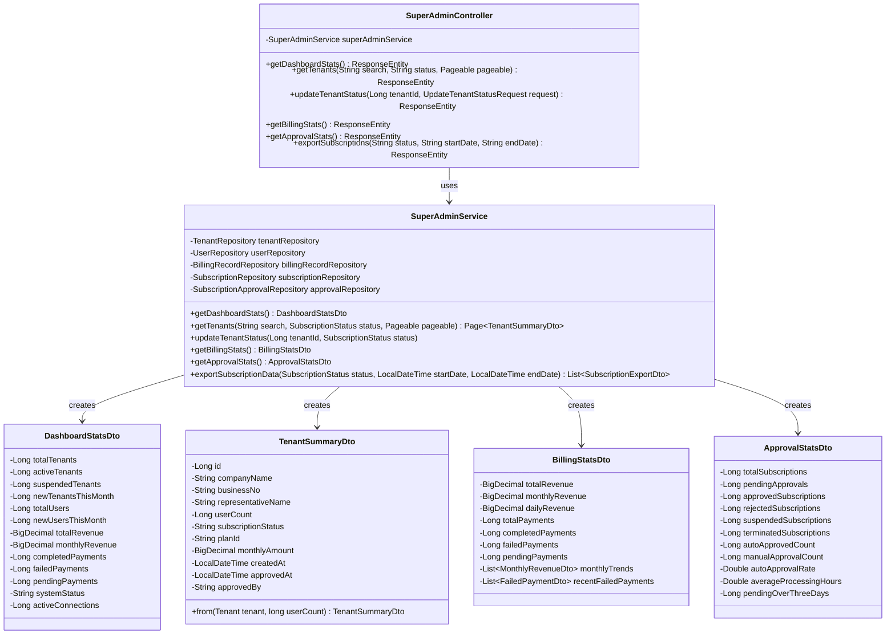

# SmartCON Lite 클래스 다이어그램

## 전체 시스템 아키텍처

## 1. Global 패키지 클래스 다이어그램

## 2. User Domain 클래스 다이어그램

## 3. Subscription Domain 클래스 다이어그램

## 4. Admin Domain 클래스 다이어그램

## 5. Frontend 컴포넌트 클래스 다이어그램

## 6. 데이터베이스 ERD

## 7. 시퀀스 다이어그램 - 구독 승인 프로세스

## 8. 컴포넌트 상호작용 다이어그램

이 클래스 다이어그램들은 SmartCON Lite 시스템의 전체적인 구조와 각 컴포넌트 간의 관계를 시각적으로 보여줍니다. 각 다이어그램은 특정 도메인이나 계층에 초점을 맞춰 설계되었으며, 시스템의 복잡성을 관리 가능한 단위로 분해하여 표현했습니다.