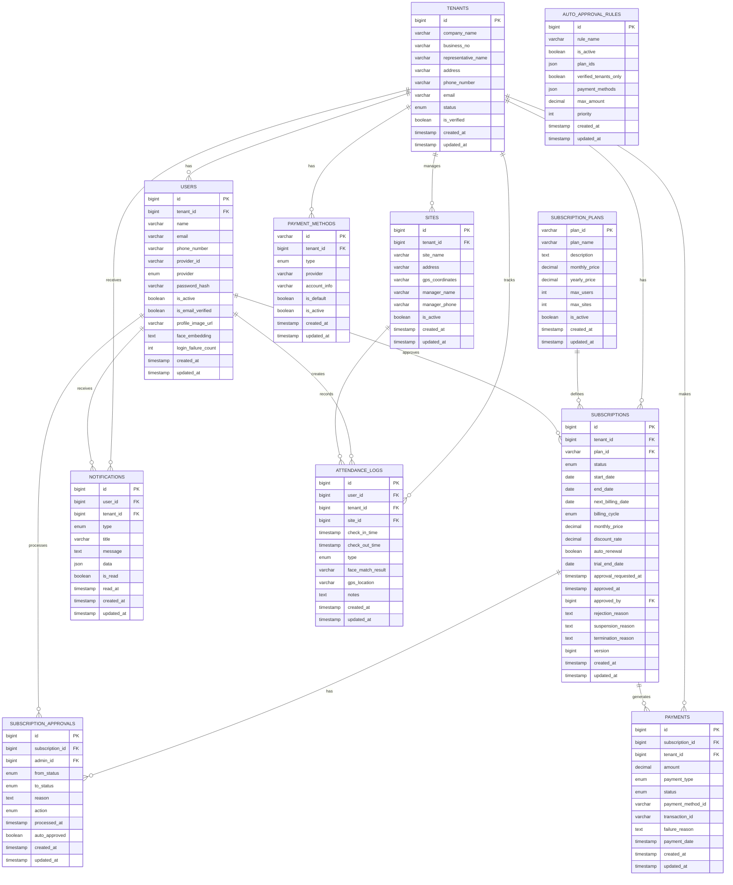

# SmartCON Lite 클래스 다이어그램

## 전체 시스템 아키텍처


### 아키텍처 설명
- **Frontend Layer**: React 기반의 사용자 인터페이스 계층
  - Pages: 라우팅 기반의 페이지 컴포넌트들
  - Components: 재사용 가능한 UI 컴포넌트들
  - Hooks: API 호출 및 상태 관리를 위한 커스텀 훅들
  - Stores: Zustand 기반의 전역 상태 관리

- **Backend Layer**: Spring Boot 기반의 서버 애플리케이션 계층
  - Controllers: HTTP 요청을 처리하는 REST API 엔드포인트
  - Services: 핵심 비즈니스 로직을 담당하는 서비스 계층
  - Repositories: JPA 기반의 데이터 접근 계층
  - Entities: 도메인 객체 및 데이터베이스 매핑 엔티티

- **Database Layer**: MariaDB 기반의 데이터 저장소

## 1. Global 패키지 클래스 다이어그램

### 전역 공통 클래스 및 설정
이 패키지는 시스템 전반에서 사용되는 공통 기능들을 제공합니다.


### 주요 기능 설명

#### BaseEntity
- 모든 엔티티의 기본 클래스로 공통 필드와 메서드 제공
- JPA Auditing을 통한 생성/수정 시간 자동 관리
- equals/hashCode 메서드를 통한 엔티티 동등성 보장

#### BaseTenantEntity
- 멀티테넌트 아키텍처를 위한 기본 엔티티
- 모든 데이터 조회 시 자동으로 테넌트 필터링 적용
- 데이터 격리를 통한 보안 강화

#### TenantContext
- ThreadLocal을 사용한 요청별 테넌트 컨텍스트 관리
- 각 HTTP 요청마다 독립적인 테넌트 정보 유지
- 메모리 누수 방지를 위한 컨텍스트 정리 기능

#### 보안 및 인증
- JWT 기반 무상태 인증 시스템
- 구독 상태에 따른 세밀한 접근 제어
- Spring Security와 통합된 보안 설정

## 2. User Domain 클래스 다이어그램

### 사용자 관리 도메인
사용자 인증, 권한 관리, 프로필 관리를 담당하는 핵심 도메인입니다.


### 주요 기능 설명

#### User 엔티티
- **멀티 로그인 지원**: 일반 회원가입, 카카오, 네이버 소셜 로그인
- **얼굴 인식 연동**: FaceNet 임베딩 벡터 저장으로 출입 관리 지원
- **보안 강화**: 로그인 실패 횟수 추적 및 계정 잠금 기능
- **이메일 인증**: 계정 활성화를 위한 이메일 인증 프로세스

#### 역할 기반 접근 제어 (RBAC)
- **5단계 권한 체계**: 슈퍼 관리자부터 작업자까지 세분화된 권한
- **계층적 권한 구조**: 상위 권한이 하위 권한의 기능 포함
- **테넌트별 격리**: 각 회사별로 독립적인 사용자 관리

#### 서비스 계층 패턴
- **인터페이스 분리**: 비즈니스 로직과 구현체 분리로 테스트 용이성 향상
- **트랜잭션 관리**: @Transactional을 통한 데이터 일관성 보장
- **예외 처리**: 도메인별 커스텀 예외를 통한 명확한 오류 처리

## 3. Subscription Domain 클래스 다이어그램

### 구독 관리 및 승인 워크플로우 도메인
SaaS 서비스의 핵심인 구독 관리, 승인 프로세스, 자동 승인 규칙을 담당합니다.


### 주요 기능 설명

#### 구독 생명주기 관리
- **신청 → 승인 → 활성화**: 체계적인 구독 승인 워크플로우
- **상태 추적**: 각 구독의 상태 변화를 상세히 기록
- **버전 관리**: 낙관적 락을 통한 동시성 제어

#### 자동 승인 시스템
- **규칙 기반 승인**: 미리 정의된 규칙에 따른 자동 승인
- **우선순위 처리**: 여러 규칙 중 우선순위에 따른 적용
- **유연한 조건**: 플랜, 금액, 결제 수단, 테넌트 인증 상태 등 다양한 조건 지원

#### 승인 이력 관리
- **완전한 추적성**: 모든 승인 관련 액션의 상세 기록
- **책임 추적**: 누가, 언제, 왜 승인/거부했는지 명확한 기록
- **감사 지원**: 규제 준수 및 내부 감사를 위한 완전한 로그

#### 알림 연동
- **실시간 알림**: 구독 상태 변경 시 관련자에게 즉시 알림
- **다채널 지원**: 이메일, SMS, 푸시 알림 등 다양한 채널 지원

## 4. Admin Domain 클래스 다이어그램

### 슈퍼 관리자 도메인
시스템 전체를 관리하는 슈퍼 관리자의 대시보드, 통계, 모니터링 기능을 제공합니다.


### 주요 기능 설명

#### 대시보드 통계 (DashboardStatsDto)
- **실시간 모니터링**: 시스템 전체의 핵심 지표를 실시간으로 제공
- **성장 지표**: 신규 테넌트 및 사용자 증가 추이 분석
- **수익 관리**: 총 매출, 월 매출 등 재무 지표 추적
- **시스템 상태**: 서버 상태 및 활성 연결 수 모니터링

#### 테넌트 관리 (TenantSummaryDto)
- **통합 뷰**: 모든 테넌트의 핵심 정보를 한눈에 조회
- **검색 및 필터링**: 회사명, 구독 상태 등으로 효율적인 검색
- **상태 관리**: 테넌트별 구독 상태 실시간 변경 가능
- **사용자 추적**: 테넌트별 사용자 수 및 활동 현황 파악

#### 결제 통계 (BillingStatsDto)
- **매출 분석**: 일/월/총 매출 현황 및 추이 분석
- **결제 현황**: 성공/실패/대기 중인 결제 건수 추적
- **트렌드 분석**: 월별 매출 추이를 통한 성장 패턴 파악
- **실패 분석**: 결제 실패 원인 분석 및 대응 방안 수립

#### 승인 통계 (ApprovalStatsDto)
- **승인 효율성**: 자동 승인율 및 평균 처리 시간 측정
- **워크플로우 최적화**: 승인 프로세스의 병목 지점 식별
- **SLA 관리**: 3일 이상 대기 건수를 통한 서비스 품질 관리
- **의사결정 지원**: 승인 패턴 분석을 통한 정책 개선 근거 제공

#### 데이터 내보내기
- **규제 준수**: 감사 및 규제 요구사항에 따른 데이터 추출
- **분석 지원**: 외부 분석 도구와의 연동을 위한 데이터 제공
- **백업 및 아카이브**: 중요 데이터의 정기적 백업 지원

## 5. Frontend 컴포넌트 클래스 다이어그램


## 6. 데이터베이스 ERD



## 7. 시퀀스 다이어그램 - 구독 승인 프로세스


## 8. 컴포넌트 상호작용 다이어그램

```mermaid
graph TD
    subgraph "Super Admin Pages"
        A[ApprovalsSuper]
        T[TenantsSuper]
        AA[AutoApprovalSuper]
    
    subgraph "Shared Components"
        SDM[SubscriptionDetailModal]
        SG[SubscriptionGuard]
        SSD[SubscriptionStatusDisplay]
        ND[NotificationDropdown]
    end
    
    subgraph "Custom Hooks"
        UAA[useAdminApi]
        USAC[useSubscriptionAccessControl]
        UAAR[useAutoApprovalRules]
        UN[useNotifications]
    end
    
    subgraph "Stores"
        NS[notificationStore]
    end
    
    subgraph "Backend APIs"
        SAC[SubscriptionApprovalController]
        SC[SuperAdminController]
        AAC[AutoApprovalController]
    end
    
    A --> SDM
    A --> UAA
    T --> SDM
    T --> UAA
    AA --> UAAR
    
    SDM --> UAA
    SG --> USAC
    ND --> UN
    ND --> NS
    
    UAA --> SAC
    UAA --> SC
    UAAR --> AAC
    UN --> SAC
    
    USAC --> SG
    NS --> ND
```

이 클래스 다이어그램들은 SmartCON Lite 시스템의 전체적인 구조와 각 컴포넌트 간의 관계를 시각적으로 보여줍니다. 각 다이어그램은 특정 도메인이나 계층에 초점을 맞춰 설계되었으며, 시스템의 복잡성을 관리 가능한 단위로 분해하여 표현했습니다.