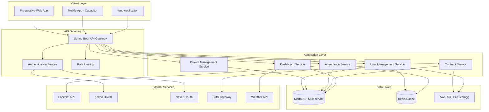
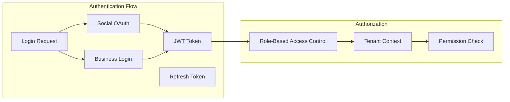

# Design Document

## Overview

SmartCON Lite 5단계 역할 기반 시스템은 건설 현장의 인력 관리를 위한 멀티테넌트 SaaS 플랫폼입니다. 
새로운 5단계 사용자 역할(슈퍼관리자, 본사관리자, 현장관리자, 노무팀장, 일반노무자)별로 최적화된 기능을 제공하며, 
통합 로그인 시스템(관리자: 사업자번호+비밀번호, 개인사용자: 소셜로그인)과 CI값 기반 사용자 관리, 
모바일 우선 설계와 FaceNet 기반 얼굴인식 출역 관리를 핵심으로 합니다.

시스템은 React + TypeScript 기반 프론트엔드와 Spring Boot + MariaDB 기반 백엔드로 구성되며, 
Capacitor를 통한 하이브리드 모바일 앱을 지원하여 PC웹, 모바일웹, 모바일앱 통합 환경을 제공합니다.

## Architecture

### System Architecture



### Multi-tenant Architecture

시스템은 Shared Database, Shared Schema 방식의 멀티테넌트 아키텍처를 사용합니다:

- **테넌트 격리**: 모든 비즈니스 엔티티에 `tenant_id` 컬럼 포함
- **데이터 격리**: JPA 필터를 통한 자동 테넌트 필터링
- **파일 격리**: S3 경로에 테넌트 ID 포함 (`/tenant/{tenant_id}/...`)
- **캐시 격리**: Redis 키에 테넌트 ID 접두사 사용

### Security Architecture



## Components and Interfaces

### Frontend Components

#### Core Components
- **AuthProvider**: 인증 상태 관리 및 토큰 처리
- **TenantProvider**: 테넌트 컨텍스트 관리
- **RoleGuard**: 역할 기반 라우트 보호
- **MobileDetector**: 모바일/데스크톱 환경 감지
- **OfflineHandler**: 오프라인 상태 처리

#### Role-specific Components
- **SuperAdminDashboard**: 슈퍼관리자 대시보드 (구독 승인, 테넌트 관리)
- **HQDashboard**: 본사관리자 대시보드 (회사 전체 관리)
- **SiteDashboard**: 현장관리자 대시보드 (현장별 관리)
- **TeamDashboard**: 노무팀장 대시보드 (팀 단위 관리)
- **WorkerDashboard**: 일반노무자 대시보드 (개인 정보 관리)

#### Authentication Components
- **UnifiedLoginPage**: 통합 로그인 페이지 (개인사용자/관리자 구분)
- **BusinessLoginForm**: 사업자번호 + 비밀번호 로그인 폼
- **SocialLoginButtons**: 소셜 로그인 버튼 (카카오, 네이버)
- **PhoneVerification**: 휴대폰 인증 컴포넌트 (CI값 생성)
- **RoleSelector**: 역할 선택 컴포넌트
- **SiteSelector**: 현장 선택 컴포넌트

#### Shared UI Components
- **DataTable**: 페이징, 정렬, 필터링 지원 테이블
- **SearchFilter**: 통합 검색 및 필터 컴포넌트
- **AttendanceChart**: 출역 현황 차트
- **ContractStatus**: 계약 상태 표시 컴포넌트
- **FaceRegistration**: 안면 등록 컴포넌트

### Backend Services

#### Core Services
```java
@Service
public class AuthenticationService {
    // 통합 로그인 처리
    public AuthResponse authenticateUnified(UnifiedLoginRequest request);
    
    // 소셜 로그인 처리 (노무팀장, 일반노무자)
    public AuthResponse authenticateSocial(SocialLoginRequest request);
    
    // 사업자 로그인 처리 (슈퍼관리자, 본사관리자, 현장관리자)
    public AuthResponse authenticateBusiness(BusinessLoginRequest request);
    
    // 휴대폰 인증 및 CI값 생성
    public CiValueResponse generateCiValue(PhoneVerificationRequest request);
    
    // 토큰 갱신
    public AuthResponse refreshToken(String refreshToken);
    
    // 역할별 로그인 유형 검증
    public boolean validateLoginTypeForRole(Role role, LoginType loginType);
}

@Service
public class UserManagementService {
    // CI값 기반 사용자 조회/생성 (개인사용자용)
    public User findOrCreateUserByCi(String ciValue, SocialProvider provider);
    
    // 사업자번호 기반 사용자 조회 (관리자용)
    public User findUserByBusinessNumber(String businessNumber);
    
    // 5단계 역할 및 현장 선택
    public List<UserRole> getUserRoles(Long userId);
    public List<Site> getUserSites(Long userId, Role role);
    
    // 개인정보 관리 (CI값 연계)
    public void updatePersonalInfo(Long userId, PersonalInfoRequest request);
    
    // 사업자 정보 관리
    public void updateBusinessInfo(Long userId, BusinessInfoRequest request);
}

@Service
public class SuperAdminService {
    // 구독 승인 관리
    public List<SubscriptionApproval> getPendingApprovals();
    public void approveSubscription(Long subscriptionId, String reason);
    public void rejectSubscription(Long subscriptionId, String reason);
    
    // 테넌트 관리
    public List<Tenant> getAllTenants(TenantFilter filter);
    public TenantStatistics getTenantStatistics();
    
    // 시스템 모니터링
    public SystemHealth getSystemHealth();
    public List<SystemMetrics> getSystemMetrics();
}

@Service  
public class ProjectManagementService {
    // 프로젝트 생성 및 관리 (본사관리자, 현장관리자)
    public Project createProject(CreateProjectRequest request);
    public List<Project> getProjectsByTenant(Long tenantId);
    public List<Project> getProjectsByManager(Long managerId);
    
    // 현장 관리자 초대 및 배정
    public void inviteSiteManager(Long projectId, InviteManagerRequest request);
    public void assignSiteManager(Long projectId, Long managerId);
}

@Service
public class AttendanceService {
    // 출역 기록 조회 (역할별 권한 적용)
    public List<AttendanceRecord> getAttendanceRecords(AttendanceQuery query, Role userRole);
    
    // FaceNet 연동 및 동기화
    public void syncFaceData(Long siteId, LocalDate workDate);
    public void registerFaceEmbedding(Long userId, String embedding);
    
    // 출역 통계 (역할별 범위 적용)
    public AttendanceStatistics getAttendanceStats(Long siteId, DateRange range, Role userRole);
    
    // 출역 수정 (권한 검증 포함)
    public void modifyAttendance(Long recordId, AttendanceModification modification, Role userRole);
}

@Service
public class ContractService {
    // 계약서 생성 및 관리
    public Contract generateContract(Long workerId, Long siteId, ContractTemplate template);
    
    // 전자서명 처리
    public void signContract(Long contractId, SignatureData signature);
    
    // 계약 상태 조회 (역할별 권한 적용)
    public List<Contract> getContractsByStatus(ContractStatus status, Role userRole);
    
    // 계약 수정 요청 (일반노무자)
    public void requestContractModification(Long contractId, String modificationRequest);
}
```

### API Interfaces

#### Authentication APIs
```http
POST /api/v1/auth/unified/login
Content-Type: application/json
{
  "loginType": "BUSINESS|SOCIAL",
  "businessNumber": "string", // 관리자 로그인시
  "password": "string", // 관리자 로그인시
  "provider": "KAKAO|NAVER", // 소셜 로그인시
  "authCode": "string", // 소셜 로그인시
  "phoneNumber": "string" // 최초 소셜 로그인시
}

POST /api/v1/auth/phone/verify
Content-Type: application/json
{
  "phoneNumber": "string",
  "verificationCode": "string"
}

POST /api/v1/auth/ci/generate
Content-Type: application/json
{
  "phoneNumber": "string",
  "verificationToken": "string"
}

GET /api/v1/auth/roles
Authorization: Bearer {token}

GET /api/v1/auth/sites?role={role}
Authorization: Bearer {token}
```

#### Super Admin APIs
```http
GET /api/v1/super-admin/dashboard
Authorization: Bearer {token}

GET /api/v1/super-admin/subscriptions/pending
Authorization: Bearer {token}
Query Parameters: page, size, sort

POST /api/v1/super-admin/subscriptions/{id}/approve
Authorization: Bearer {token}
Content-Type: application/json
{
  "reason": "string"
}

POST /api/v1/super-admin/subscriptions/{id}/reject
Authorization: Bearer {token}
Content-Type: application/json
{
  "reason": "string"
}

GET /api/v1/super-admin/tenants
Authorization: Bearer {token}
Query Parameters: status, search, page, size

GET /api/v1/super-admin/system/health
Authorization: Bearer {token}
```

#### User Management APIs
```http
GET /api/v1/users/roles
Authorization: Bearer {token}

GET /api/v1/users/sites?role={role}
Authorization: Bearer {token}

PUT /api/v1/users/profile
Authorization: Bearer {token}
Content-Type: application/json
{
  "name": "string",
  "phoneNumber": "string",
  "email": "string",
  "address": "string",
  "bankAccount": {
    "bankName": "string",
    "accountNumber": "string"
  }
}
```

#### Project Management APIs
```http
GET /api/v1/projects
Authorization: Bearer {token}
Query Parameters: status, search, page, size

POST /api/v1/projects
Authorization: Bearer {token}
Content-Type: application/json
{
  "name": "string",
  "constructionPeriod": {
    "startDate": "date",
    "endDate": "date"
  },
  "siteManagerId": "long",
  "faceRecognitionDevices": ["string"]
}

GET /api/v1/projects/{projectId}
Authorization: Bearer {token}
```

#### Attendance APIs
```http
GET /api/v1/attendance/records
Authorization: Bearer {token}
Query Parameters: siteId, startDate, endDate, workerId, teamId

GET /api/v1/attendance/dashboard
Authorization: Bearer {token}
Query Parameters: siteId, role

POST /api/v1/attendance/face-sync
Authorization: Bearer {token}
Content-Type: application/json
{
  "siteId": "long",
  "workDate": "date"
}
```

## Data Models

### Core Entities

#### User Entity
```java
@Entity
@Table(name = "users")
public class User extends BaseTenantEntity {
    @Id
    @GeneratedValue(strategy = GenerationType.IDENTITY)
    private Long id;
    
    @Column(nullable = false)
    private String name;
    
    @Column(name = "email")
    private String email;
    
    @Column(name = "phone_number")
    private String phoneNumber;
    
    @Column(name = "ci_value", unique = true)
    private String ciValue; // 휴대폰 인증 CI값 (개인사용자 식별용)
    
    @Column(name = "business_number")
    private String businessNumber; // 사업자등록번호 (관리자 로그인용)
    
    @Enumerated(EnumType.STRING)
    private AuthProvider provider; // LOCAL, KAKAO, NAVER
    
    @Enumerated(EnumType.STRING)
    private LoginType loginType; // BUSINESS, SOCIAL
    
    @ElementCollection(fetch = FetchType.EAGER)
    @Enumerated(EnumType.STRING)
    private Set<Role> roles = new HashSet<>();
    
    @Column(name = "password_hash")
    private String passwordHash; // 사업자 로그인용 (소셜 로그인시 null)
    
    @Column(name = "is_active")
    private Boolean isActive = true;
    
    @Column(name = "is_phone_verified")
    private Boolean isPhoneVerified = false;
    
    @OneToMany(mappedBy = "user", cascade = CascadeType.ALL)
    private List<SocialAccount> socialAccounts = new ArrayList<>();
    
    @Embedded
    private PersonalInfo personalInfo;
    
    @Embedded
    private BusinessInfo businessInfo; // 관리자용 사업자 정보
    
    // CI값 기반 사용자 식별 메서드
    public boolean isSamePersonAs(String ciValue) {
        return this.ciValue != null && this.ciValue.equals(ciValue);
    }
    
    // 로그인 유형별 검증 메서드
    public boolean canUseLoginType(LoginType loginType) {
        return switch (loginType) {
            case BUSINESS -> roles.stream().anyMatch(role -> 
                role == Role.ROLE_SUPER || role == Role.ROLE_HQ || role == Role.ROLE_SITE);
            case SOCIAL -> roles.stream().anyMatch(role -> 
                role == Role.ROLE_TEAM || role == Role.ROLE_WORKER);
        };
    }
}

@Embeddable
public class PersonalInfo {
    private String residentNumber; // 암호화 저장
    private String address;
    private String emergencyContact;
    private String profileImageUrl;
    
    @Embedded
    private BankAccount bankAccount;
}

@Embeddable
public class BusinessInfo {
    private String companyName;
    private String businessRegistrationNumber;
    private String representativeName;
    private String businessAddress;
    private String businessPhone;
    private String businessEmail;
}

@Entity
@Table(name = "social_accounts")
public class SocialAccount extends BaseEntity {
    @Id
    @GeneratedValue(strategy = GenerationType.IDENTITY)
    private Long id;
    
    @ManyToOne(fetch = FetchType.LAZY)
    @JoinColumn(name = "user_id")
    private User user;
    
    @Enumerated(EnumType.STRING)
    private SocialProvider provider; // KAKAO, NAVER
    
    @Column(name = "provider_id")
    private String providerId; // 소셜 제공자의 사용자 ID
    
    @Column(name = "provider_email")
    private String providerEmail;
    
    @Column(name = "linked_at")
    private LocalDateTime linkedAt;
    
    @Column(name = "is_primary")
    private Boolean isPrimary = false; // 주 계정 여부
}
```

#### Project Entity
```java
@Entity
@Table(name = "projects")
public class Project extends BaseTenantEntity {
    @Id
    @GeneratedValue(strategy = GenerationType.IDENTITY)
    private Long id;
    
    @Column(nullable = false)
    private String name;
    
    @Column(name = "construction_name")
    private String constructionName;
    
    @Embedded
    private ConstructionPeriod constructionPeriod;
    
    @ManyToOne(fetch = FetchType.LAZY)
    @JoinColumn(name = "site_manager_id")
    private User siteManager;
    
    @Enumerated(EnumType.STRING)
    private ProjectStatus status; // PLANNING, ACTIVE, PAUSED, COMPLETED
    
    @OneToMany(mappedBy = "project", cascade = CascadeType.ALL)
    private List<FaceRecognitionDevice> faceDevices = new ArrayList<>();
    
    @OneToMany(mappedBy = "project", cascade = CascadeType.ALL)
    private List<Team> teams = new ArrayList<>();
}

@Embeddable
public class ConstructionPeriod {
    @Column(name = "start_date")
    private LocalDate startDate;
    
    @Column(name = "end_date") 
    private LocalDate endDate;
}
```

#### Attendance Entity
```java
@Entity
@Table(name = "attendance_records")
public class AttendanceRecord extends BaseTenantEntity {
    @Id
    @GeneratedValue(strategy = GenerationType.IDENTITY)
    private Long id;
    
    @ManyToOne(fetch = FetchType.LAZY)
    @JoinColumn(name = "worker_id", nullable = false)
    private User worker;
    
    @ManyToOne(fetch = FetchType.LAZY)
    @JoinColumn(name = "project_id", nullable = false)
    private Project project;
    
    @ManyToOne(fetch = FetchType.LAZY)
    @JoinColumn(name = "team_id")
    private Team team;
    
    @Column(name = "work_date", nullable = false)
    private LocalDate workDate;
    
    @Column(name = "check_in_time")
    private LocalDateTime checkInTime;
    
    @Column(name = "check_out_time")
    private LocalDateTime checkOutTime;
    
    @Column(name = "work_hours", precision = 4, scale = 2)
    private BigDecimal workHours;
    
    @Column(name = "unit_price", precision = 10, scale = 2)
    private BigDecimal unitPrice;
    
    @Enumerated(EnumType.STRING)
    private JobType jobType;
    
    @Column(name = "change_reason")
    private String changeReason; // 변경사항 및 사유
    
    @Enumerated(EnumType.STRING)
    private AttendanceStatus status; // PRESENT, ABSENT, LATE, EARLY_LEAVE
}
```

#### Contract Entity
```java
@Entity
@Table(name = "contracts")
public class Contract extends BaseTenantEntity {
    @Id
    @GeneratedValue(strategy = GenerationType.IDENTITY)
    private Long id;
    
    @ManyToOne(fetch = FetchType.LAZY)
    @JoinColumn(name = "worker_id", nullable = false)
    private User worker;
    
    @ManyToOne(fetch = FetchType.LAZY)
    @JoinColumn(name = "project_id", nullable = false)
    private Project project;
    
    @Column(name = "work_date", nullable = false)
    private LocalDate workDate;
    
    @Enumerated(EnumType.STRING)
    private JobType jobType;
    
    @Column(name = "unit_price", precision = 10, scale = 2)
    private BigDecimal unitPrice;
    
    @Enumerated(EnumType.STRING)
    private ContractStatus status; // PENDING, SIGNED, EXPIRED, CANCELLED
    
    @Column(name = "contract_file_url")
    private String contractFileUrl; // S3 URL
    
    @Column(name = "signature_data", columnDefinition = "TEXT")
    private String signatureData; // Base64 encoded signature
    
    @Column(name = "signed_at")
    private LocalDateTime signedAt;
    
    @Column(name = "modification_request")
    private String modificationRequest; // 변경 요청사항 (메모)
}
```

### Enums and Value Objects

```java
public enum Role {
    ROLE_SUPER(1, "슈퍼관리자"),      // 시스템 전체 관리, 구독 승인
    ROLE_HQ(2, "본사관리자"),         // 회사 전체 관리, 사업자번호 로그인
    ROLE_SITE(3, "현장관리자"),       // 현장별 관리, 사업자번호 로그인
    ROLE_TEAM(4, "노무팀장"),         // 팀 단위 관리, 소셜 로그인
    ROLE_WORKER(5, "일반노무자");     // 개인 정보 관리, 소셜 로그인
    
    private final int level;
    private final String displayName;
    
    Role(int level, String displayName) {
        this.level = level;
        this.displayName = displayName;
    }
    
    public boolean canAccess(Role targetRole) {
        return this.level <= targetRole.level;
    }
    
    public boolean requiresBusinessLogin() {
        return this == ROLE_SUPER || this == ROLE_HQ || this == ROLE_SITE;
    }
    
    public boolean allowsSocialLogin() {
        return this == ROLE_TEAM || this == ROLE_WORKER;
    }
}

public enum LoginType {
    BUSINESS("사업자 로그인"),    // 사업자번호 + 비밀번호 (관리자용)
    SOCIAL("소셜 로그인");       // 카카오/네이버 (개인사용자용)
    
    private final String displayName;
    
    LoginType(String displayName) {
        this.displayName = displayName;
    }
    
    public Set<Role> getAllowedRoles() {
        return switch (this) {
            case BUSINESS -> Set.of(Role.ROLE_SUPER, Role.ROLE_HQ, Role.ROLE_SITE);
            case SOCIAL -> Set.of(Role.ROLE_TEAM, Role.ROLE_WORKER);
        };
    }
}

public enum AuthProvider {
    LOCAL("일반 로그인"),      // 사업자번호 + 비밀번호
    KAKAO("카카오"),          // 카카오 소셜 로그인
    NAVER("네이버");          // 네이버 소셜 로그인
    
    private final String displayName;
    
    AuthProvider(String displayName) {
        this.displayName = displayName;
    }
    
    public boolean isSocialProvider() {
        return this == KAKAO || this == NAVER;
    }
    
    public LoginType getLoginType() {
        return isSocialProvider() ? LoginType.SOCIAL : LoginType.BUSINESS;
    }
}

public enum SocialProvider {
    KAKAO("카카오", "https://kauth.kakao.com/oauth/authorize"),
    NAVER("네이버", "https://nid.naver.com/oauth2.0/authorize");
    
    private final String displayName;
    private final String authUrl;
    
    SocialProvider(String displayName, String authUrl) {
        this.displayName = displayName;
        this.authUrl = authUrl;
    }
}

public enum JobType {
    EARTHWORK("토공"),        // 토공
    CONCRETE("콘크리트공"),    // 콘크리트공
    REBAR("철근공"),          // 철근공
    MASONRY("조적공"),        // 조적공
    CARPENTRY("목공"),        // 목공
    GENERAL_LABOR("일반인부"); // 일반인부
    
    private final String displayName;
    
    JobType(String displayName) {
        this.displayName = displayName;
    }
}

public enum ProjectStatus {
    PLANNING("계획중"),   // 계획중
    ACTIVE("진행중"),     // 진행중
    PAUSED("일시중지"),   // 일시중지
    COMPLETED("완료");    // 완료
    
    private final String displayName;
    
    ProjectStatus(String displayName) {
        this.displayName = displayName;
    }
}

public enum ContractStatus {
    PENDING("서명대기"),    // 서명대기
    SIGNED("서명완료"),     // 서명완료
    EXPIRED("만료"),        // 만료
    CANCELLED("취소");      // 취소
    
    private final String displayName;
    
    ContractStatus(String displayName) {
        this.displayName = displayName;
    }
}

// CI값 관리를 위한 Value Object
@Embeddable
public class CiValue {
    @Column(name = "ci_value")
    private String value;
    
    @Column(name = "ci_generated_at")
    private LocalDateTime generatedAt;
    
    @Column(name = "ci_phone_number")
    private String phoneNumber; // CI값 생성에 사용된 휴대폰 번호 (암호화)
    
    public CiValue(String phoneNumber) {
        this.value = generateCiValue(phoneNumber);
        this.generatedAt = LocalDateTime.now();
        this.phoneNumber = encryptPhoneNumber(phoneNumber);
    }
    
    private String generateCiValue(String phoneNumber) {
        // 실제 구현에서는 통신사 CI값 생성 로직 사용
        return "CI_" + DigestUtils.sha256Hex(phoneNumber + System.currentTimeMillis());
    }
}
```

## Correctness Properties

*A property is a characteristic or behavior that should hold true across all valid executions of a system-essentially, a formal statement about what the system should do. Properties serve as the bridge between human-readable specifications and machine-verifiable correctness guarantees.*

### Property-Based Testing Overview

Property-based testing (PBT) validates software correctness by testing universal properties across many generated inputs. Each property is a formal specification that should hold for all valid inputs.

### Core Principles

1. **Universal Quantification**: Every property must contain an explicit "for all" statement
2. **Requirements Traceability**: Each property must reference the requirements it validates  
3. **Executable Specifications**: Properties must be implementable as automated tests
4. **Comprehensive Coverage**: Properties should cover all testable acceptance criteria

### Property Reflection

After analyzing the acceptance criteria, several properties can be consolidated to avoid redundancy:

- Authentication flow properties (1.2-1.9) can be combined into comprehensive authentication properties
- Data aggregation properties (4.1-4.3) can be combined into dashboard accuracy properties  
- Role-based access properties can be consolidated into comprehensive authorization properties
- Account management properties (2.1-2.4) can be combined into user profile management properties

### Correctness Properties

**Property 1: Social Login Flow Consistency**
*For any* user selecting "개인사용자" login type, the system should provide Kakao and Naver social login options and handle first-time users with phone verification
**Validates: Requirements 1.2, 1.3**

**Property 2: CI Value Uniqueness and Account Management**
*For any* completed phone verification, the system should generate a unique CI value and either create a new account or link to existing account based on CI value existence
**Validates: Requirements 1.4, 1.5, 1.6**

**Property 3: Business Login and 2FA Flow**
*For any* user selecting "관리자" login type with valid business credentials, the system should trigger 2FA via registered email and check role permissions upon success
**Validates: Requirements 1.7, 1.8, 1.9**

**Property 4: Role and Site Selection Logic**
*For any* user with multiple roles or multiple site assignments, the system should provide appropriate selection interfaces based on user's role and site relationships
**Validates: Requirements 1.10, 1.11**

**Property 5: Site List Ordering and Filtering**
*For any* site list request, the system should order sites by recent login, recent assignment, and remaining construction period, and support filtering by site status
**Validates: Requirements 1.12, 1.13**

**Property 6: Search Functionality Accuracy**
*For any* site name search query, the system should return only sites whose names contain the search term
**Validates: Requirements 1.14**

**Property 7: Personal Information Management**
*For any* valid personal information update, the system should validate the data, store the changes, and reflect them in subsequent retrievals
**Validates: Requirements 2.1, 2.4**

**Property 8: Social Account Linking**
*For any* user account, the system should correctly display connected social accounts and allow addition of new social accounts without conflicts
**Validates: Requirements 2.2, 2.3**

**Property 9: Cross-Platform Functionality Consistency**
*For any* supported operation, the system should provide identical functionality and results across PC web, mobile web, and mobile app platforms
**Validates: Requirements 3.5**

**Property 10: Dashboard Data Accuracy**
*For any* dashboard request, the system should display accurate counts of active projects, registered workers, and unsigned contracts based on current data state
**Validates: Requirements 4.1, 4.2, 4.3**

**Property 11: Chart Data Integrity**
*For any* chart generation request, the system should provide accurate attendance and job distribution data that matches the underlying database records
**Validates: Requirements 4.4, 4.5**

**Property 12: Authentication Security Enforcement**
*For any* authentication attempt sequence, the system should lock accounts after 5 failed attempts for 30 minutes and log all authentication events
**Validates: Requirements 27.1, 27.2**

**Property 13: Data Encryption and Security**
*For any* sensitive personal information storage, the system should encrypt the data and ensure it cannot be retrieved in plain text from storage
**Validates: Requirements 27.4**

**Property 14: Role-Based Access Control**
*For any* user request to access a resource, the system should only allow access if the user's current role has appropriate permissions for that resource
**Validates: Requirements 27.5**

**Property 15: CI Value and OAuth2 Validation**
*For any* CI value or OAuth2 token validation, the system should properly verify the authenticity and integrity of the provided credentials
**Validates: Requirements 27.6, 27.7**

**Property 16: Concurrent Access Data Integrity**
*For any* concurrent operations on shared data, the system should maintain data consistency and prevent race conditions or data corruption
**Validates: Requirements 30.2**

## Error Handling

### Authentication Errors
- **Invalid Credentials**: Clear error messages without revealing system details
- **Account Lockout**: Informative messages about lockout duration and resolution
- **2FA Failures**: Guidance for email verification issues
- **Social Login Failures**: Fallback options and retry mechanisms

### Data Validation Errors
- **Input Validation**: Field-specific error messages with correction guidance
- **Business Rule Violations**: Clear explanations of violated constraints
- **Concurrent Modification**: Optimistic locking with user-friendly conflict resolution

### System Errors
- **Service Unavailability**: Graceful degradation with offline capabilities
- **External API Failures**: Fallback mechanisms for face recognition and social login
- **Database Errors**: Transaction rollback with user notification

### Mobile-Specific Errors
- **Network Connectivity**: Offline mode with data synchronization
- **Camera/GPS Permissions**: Clear permission request explanations
- **Device Compatibility**: Graceful feature degradation for older devices

## Testing Strategy

### Dual Testing Approach
The system will employ both unit testing and property-based testing for comprehensive coverage:

**Unit Tests**: 
- Verify specific examples and edge cases
- Test integration points between components  
- Validate error conditions and boundary values
- Focus on concrete scenarios and known failure modes

**Property Tests**:
- Verify universal properties across all inputs
- Test business logic invariants
- Validate data consistency and integrity
- Ensure security and authorization rules

### Property-Based Test Configuration
- **Framework**: Use fast-check for TypeScript/JavaScript and jqwik for Java
- **Iterations**: Minimum 100 iterations per property test
- **Test Tagging**: Each property test must reference its design document property
- **Tag Format**: `Feature: smartcon-lite-role-based-system, Property {number}: {property_text}`

### Testing Priorities
1. **Authentication and Authorization**: Critical security properties
2. **Data Integrity**: Multi-tenant data isolation and consistency  
3. **Role-Based Access**: Proper permission enforcement
4. **Mobile Integration**: Cross-platform functionality
5. **Performance**: Response times and concurrent access handling

### Test Data Management
- **Multi-tenant Test Data**: Isolated test data per tenant
- **Social Login Mocking**: Mock OAuth2 providers for testing
- **Face Recognition Simulation**: Mock FaceNet API responses
- **Database Transactions**: Proper cleanup and isolation between tests